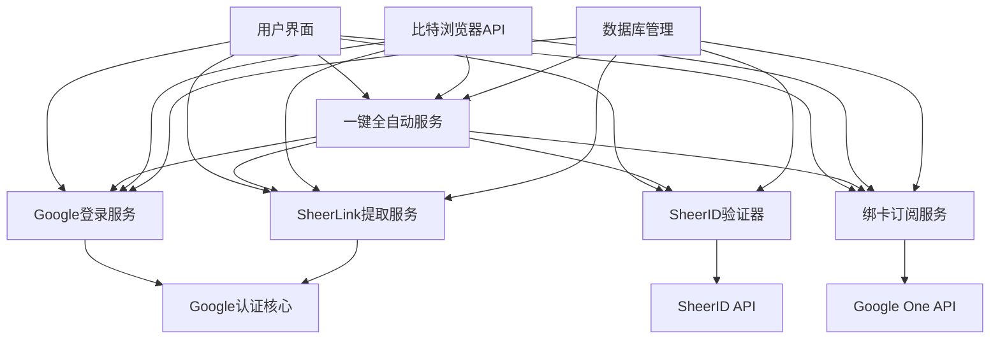
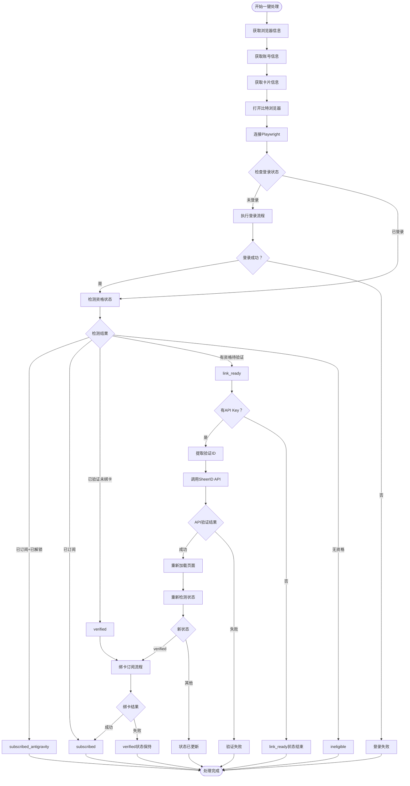
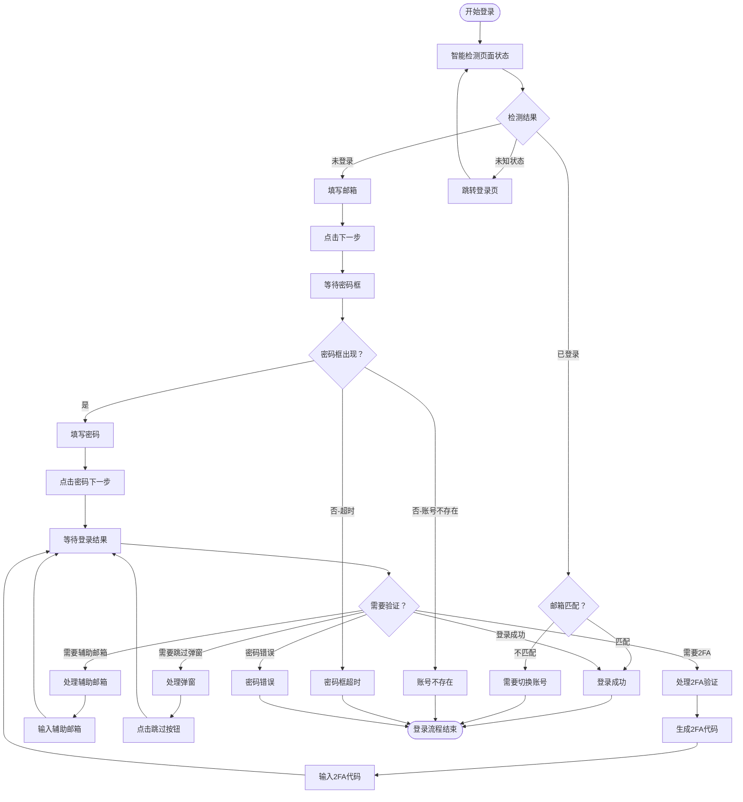
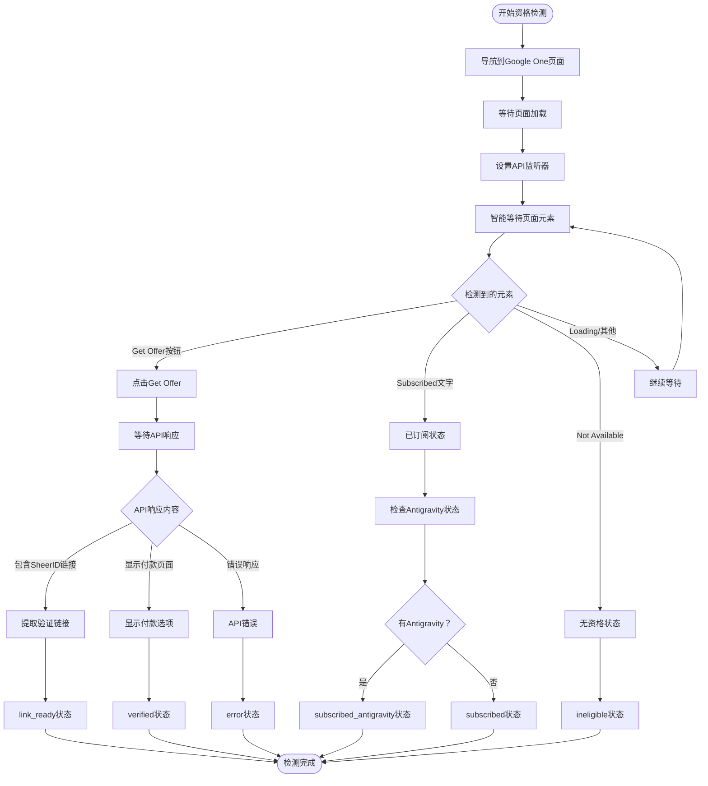
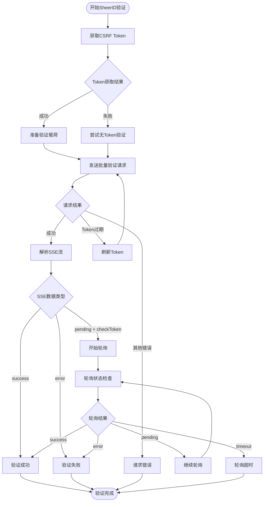
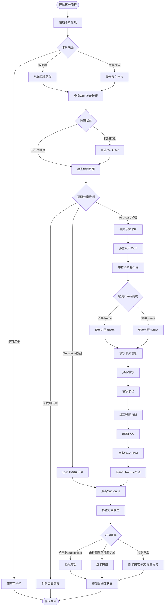

# Google自动化系统流程详解

## 概述

本系统实现了Google学生账号的完全自动化处理流程，包括登录验证、资格检测、SheerID验证、绑卡订阅等完整链路。系统采用模块化设计，支持单步执行和一键全自动处理。

## 系统架构



## 核心模块说明

### 1. Google认证核心 (google_auth.py)

**主要功能：**
- 智能登录状态检测
- 统一的Google登录流程
- 2FA和辅助邮箱验证

**核心函数：**
- `get_login_state()`: 检测当前登录状态
- `google_login()`: 执行登录流程

### 2. Google登录服务 (google_login_service.py)

**主要功能：**
- 封装完整的登录服务
- 比特浏览器集成
- 批量登录状态检测

### 3. SheerLink提取服务 (sheerlink_service.py)

**主要功能：**
- Google One学生资格检测
- SheerID验证链接提取
- 账号状态分类管理

### 4. SheerID验证器 (sheerid_verifier.py)

**主要功能：**
- 批量SheerID验证
- API状态轮询
- CSRF token管理

### 5. 绑卡订阅服务 (bind_card_service.py)

**主要功能：**
- 自动绑定测试卡
- Google One订阅处理
- iframe支付表单操作

### 6. 一键全自动服务 (all_in_one_service.py)

**主要功能：**
- 整合所有处理流程
- 状态检测与流转
- 错误处理与重试

## 详细流程图

### 一键全自动处理流程



### Google登录流程详解



### 资格检测流程



### SheerID验证流程



### 绑卡订阅流程



## 技术实现细节

### 1. 智能等待机制

系统使用Playwright的`.or()`方法实现智能等待：

```python
# 示例：智能等待多个可能的元素
avatar_button = page.get_by_role("button", name=re.compile(r"^Google (Account|帐号|账号)"))
avatar_link = page.get_by_role("link", name=re.compile(r"^Google (Account|帐号|账号)"))
email_input = page.locator('input[type="email"]')

combined = avatar_button.or_(avatar_link).or_(email_input)
await expect(combined).to_be_visible(timeout=timeout)
```

### 2. API拦截机制

通过监听网络请求获取SheerID链接：

```python
# 设置请求监听器
async def handle_request(request):
    if 'sheerid' in request.url and 'verify' in request.url:
        # 提取验证链接
        pass

page.on('request', handle_request)
```

### 3. iframe嵌套处理

绑卡流程中需要处理多层iframe：

```python
# 检测iframe结构
iframe_locator = page.frame_locator('iframe[src*="tokenized.play.google.com"]')
inner_iframe = iframe_locator.frame_locator('iframe[name="hnyNZeIframe"]')

# 智能选择合适的iframe
if await inner_iframe.locator('input').count() > 0:
    active_iframe = inner_iframe
else:
    active_iframe = iframe_locator
```

### 4. 状态管理

系统定义了完整的状态转换：

```python
STATUS_PENDING = 'pending_check'          # ❔待检测
STATUS_NOT_LOGGED_IN = 'not_logged_in'    # 🔒未登录  
STATUS_INELIGIBLE = 'ineligible'          # ❌无资格
STATUS_LINK_READY = 'link_ready'          # 🔗待验证
STATUS_VERIFIED = 'verified'              # ✅已验证
STATUS_SUBSCRIBED = 'subscribed'          # 👑已订阅
STATUS_SUBSCRIBED_ANTIGRAVITY = 'subscribed_antigravity'  # 🌟已解锁
STATUS_ERROR = 'error'                    # ⚠️错误
```

### 5. 错误处理与重试

- 网络请求自动重试机制
- CSRF Token过期自动刷新  
- 页面加载超时处理
- 元素定位失败降级处理

### 6. 并发控制

- 支持多线程批量处理
- 线程池控制并发数量
- 停止信号检测机制
- 资源自动清理

## 配置说明

### 数据库配置

系统需要以下数据库表：
- `accounts`: 存储账号信息
- `cards`: 存储卡片信息  
- `settings`: 存储API密钥等配置
- `browser_info`: 存储浏览器窗口信息

### API配置

- **SheerID API Key**: 用于学生验证
- **比特浏览器API**: 用于浏览器控制
- **Google API**: 间接通过页面操作使用

### 超时配置

```python
DEFAULT_TIMEOUT = 15000  # 默认15秒
NAVIGATION_TIMEOUT = 30000  # 页面导航30秒
POLLING_TIMEOUT = 120000  # API轮询2分钟
```

## 状态码说明

| 状态码 | 显示名称 | 说明 | 后续操作 |
|--------|----------|------|----------|
| `pending_check` | ❔待检测 | 初始状态 | 执行检测 |
| `not_logged_in` | 🔒未登录 | 需要登录 | 执行登录 |
| `ineligible` | ❌无资格 | 无学生资格 | 无法继续 |
| `link_ready` | 🔗待验证 | 有验证链接 | SheerID验证 |
| `verified` | ✅已验证 | 验证通过 | 绑卡订阅 |
| `subscribed` | 👑已订阅 | 订阅成功 | 检查功能 |
| `subscribed_antigravity` | 🌟已解锁 | 完全激活 | 流程完成 |
| `error` | ⚠️错误 | 处理异常 | 重试或跳过 |

## 使用示例

### 单步使用

```python
# 1. 仅登录
from google.backend.google_login_service import login_google_account
success, status, msg = login_google_account("browser_id_123")

# 2. 仅提取SheerLink  
from google.backend.sheerlink_service import process_browser
success, msg = process_browser("browser_id_123")

# 3. 仅验证SheerID
from google.backend.sheerid_verifier import SheerIDVerifier
verifier = SheerIDVerifier("your_api_key")
results = verifier.verify_batch(["verification_id_123"])

# 4. 仅绑卡订阅
from google.backend.bind_card_service import process_bind_card  
success, msg = process_bind_card("browser_id_123")
```

### 一键全自动

```python
from google.backend.all_in_one_service import process_all_in_one

success, final_status, message = process_all_in_one(
    browser_id="browser_id_123",
    api_key="your_sheerid_api_key",  # 可选，为空则从数据库获取
    card_info=None,  # 可选，为空则从数据库获取
    log_callback=print  # 可选，日志回调函数
)

print(f"处理结果: {success}")
print(f"最终状态: {final_status}") 
print(f"消息: {message}")
```

## 注意事项

1. **浏览器兼容性**: 系统基于Chromium内核，确保比特浏览器版本兼容
2. **网络环境**: 需要稳定的网络连接，建议使用代理
3. **API限制**: SheerID API有频率限制，注意控制并发数量
4. **卡片信息**: 确保测试卡信息正确且有效
5. **状态同步**: 多线程处理时注意数据库状态同步
6. **日志记录**: 详细的日志有助于问题诊断和流程优化

## 故障排除

### 常见问题

1. **登录失败**
   - 检查账号密码是否正确
   - 确认2FA密钥有效性
   - 验证辅助邮箱设置

2. **资格检测超时**
   - 检查网络连接
   - 确认页面加载完成
   - 增加超时时间设置

3. **SheerID验证失败**
   - 验证API Key有效性
   - 检查CSRF Token获取
   - 确认验证ID格式正确

4. **绑卡失败**
   - 检查卡片信息完整性
   - 确认iframe结构变化
   - 验证页面元素定位

5. **状态异常**
   - 检查数据库连接
   - 确认状态更新逻辑
   - 验证并发处理机制

---

*最后更新: 2026-01-22*
