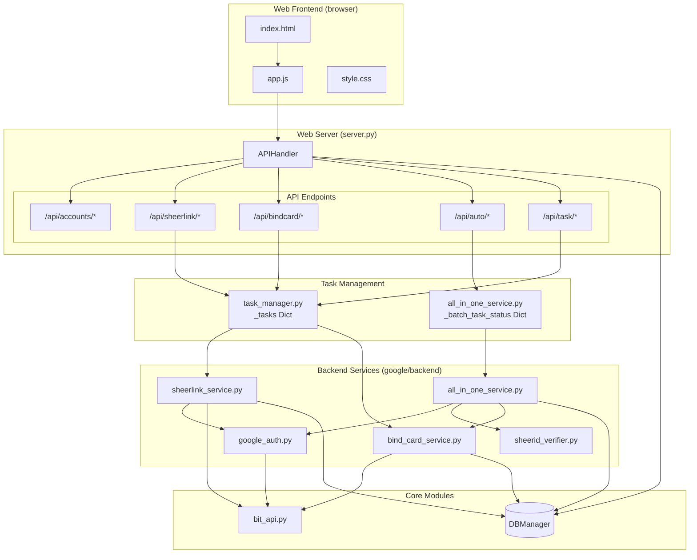
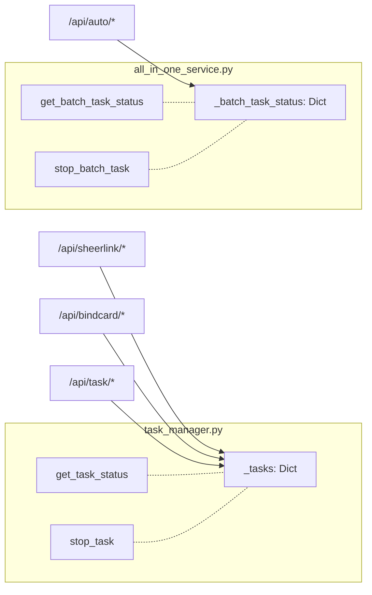
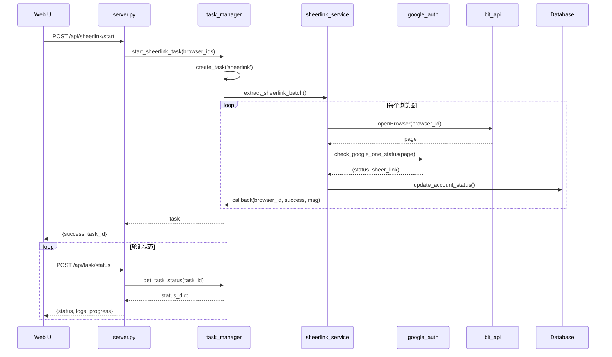
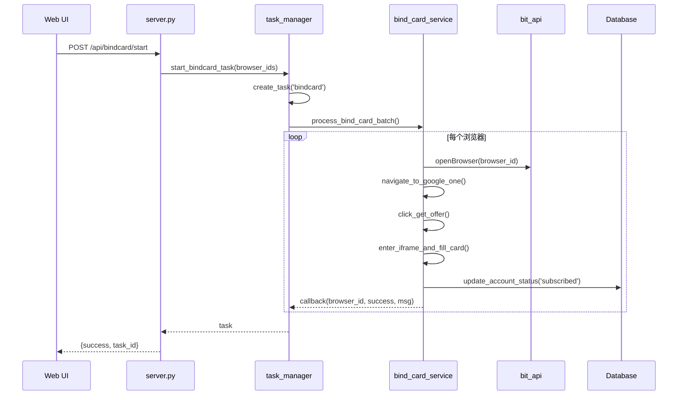
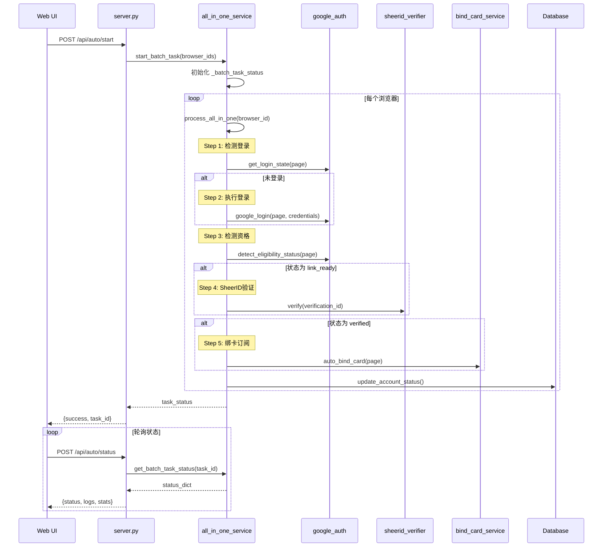
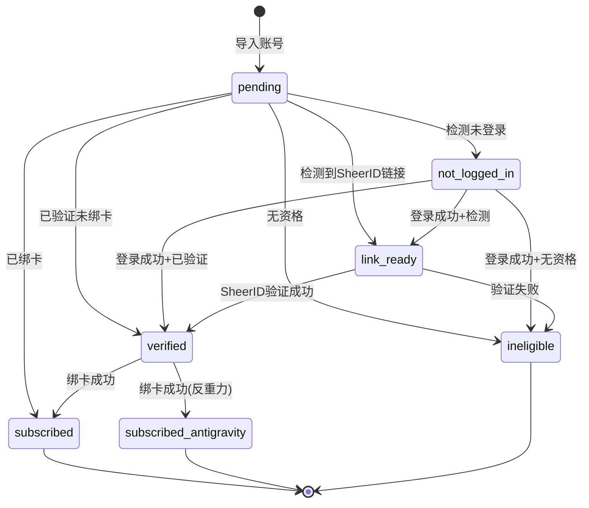

# Web 服务架构图

## 1. 整体架构



## 2. 发现的问题

### 问题1: 两套任务管理机制不统一



**问题**: 
- SheerLink/绑卡任务使用 `task_manager._tasks`
- 全自动处理任务使用 `all_in_one_service._batch_task_status`
- `/api/task/status` 只能查询前者，无法查询全自动任务

### 问题2: 返回类型不匹配

```python
# task_manager.py 第 171 行
def start_auto_process_task(...) -> TaskStatus:  # 声明返回 TaskStatus
    return start_batch_task(...)  # 实际返回 Dict ❌
```

### 问题3: API 端点混乱

| 功能 | 启动 | 状态 | 停止 |
|------|------|------|------|
| SheerLink | `/api/sheerlink/start` | `/api/task/status` | `/api/task/stop` |
| 绑卡 | `/api/bindcard/start` | `/api/task/status` | `/api/task/stop` |
| 全自动 | `/api/auto/start` | `/api/auto/status` | `/api/auto/stop` |

**问题**: 全自动处理使用独立的 API 路径，与其他任务不一致

## 3. 各功能调用流程

### 3.1 SheerLink 提取流程



### 3.2 绑卡订阅流程



### 3.3 一键全自动处理流程



## 4. 建议修复方案

### 方案一: 统一任务管理（推荐）

将 `all_in_one_service` 的任务管理移到 `task_manager.py`:

```python
# task_manager.py
def start_auto_process_task(browser_ids, api_key, card_info) -> TaskStatus:
    from google.backend.all_in_one_service import process_all_in_one_batch
    
    task = TaskManager.create_task('auto', len(browser_ids))
    
    def run():
        process_all_in_one_batch(
            browser_ids, api_key, card_info,
            log_callback=task.add_log,
            batch_progress_callback=lambda i, t, s: task.add_result(s.browser_id, ...)
        )
    
    threading.Thread(target=run, daemon=True).start()
    return task
```

### 方案二: 统一 API 路由

```python
# server.py
if path == '/api/task/status':
    # 先查 task_manager
    status = get_task_status(task_id)
    if not status:
        # 再查 all_in_one_service
        status = get_batch_task_status(task_id)
    ...
```

## 5. 数据库状态流转


