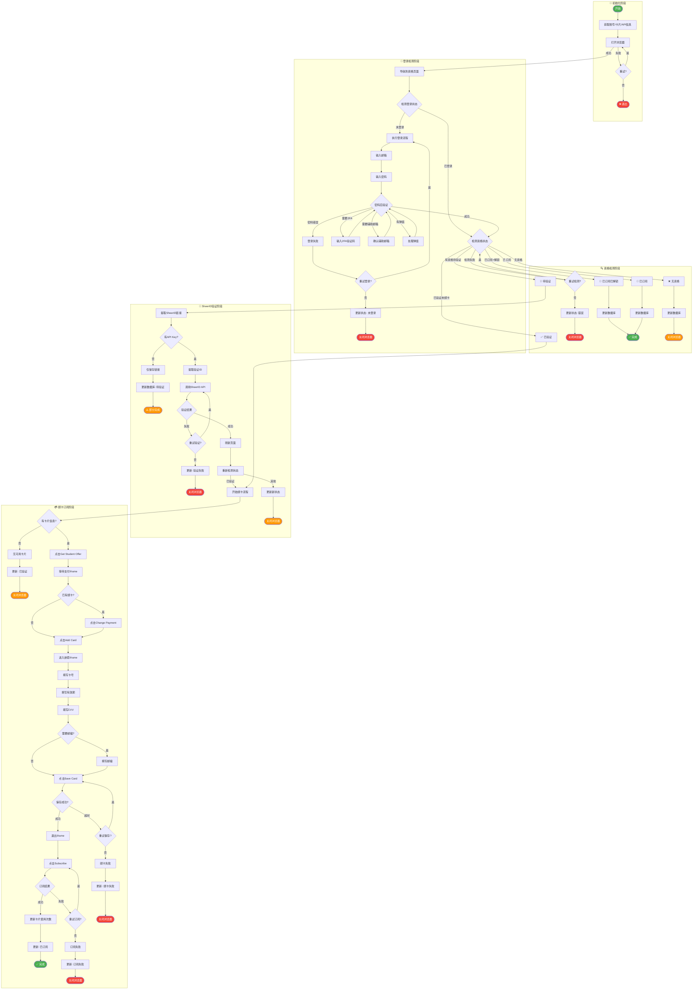
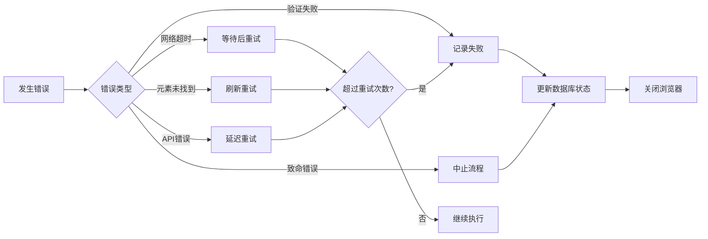
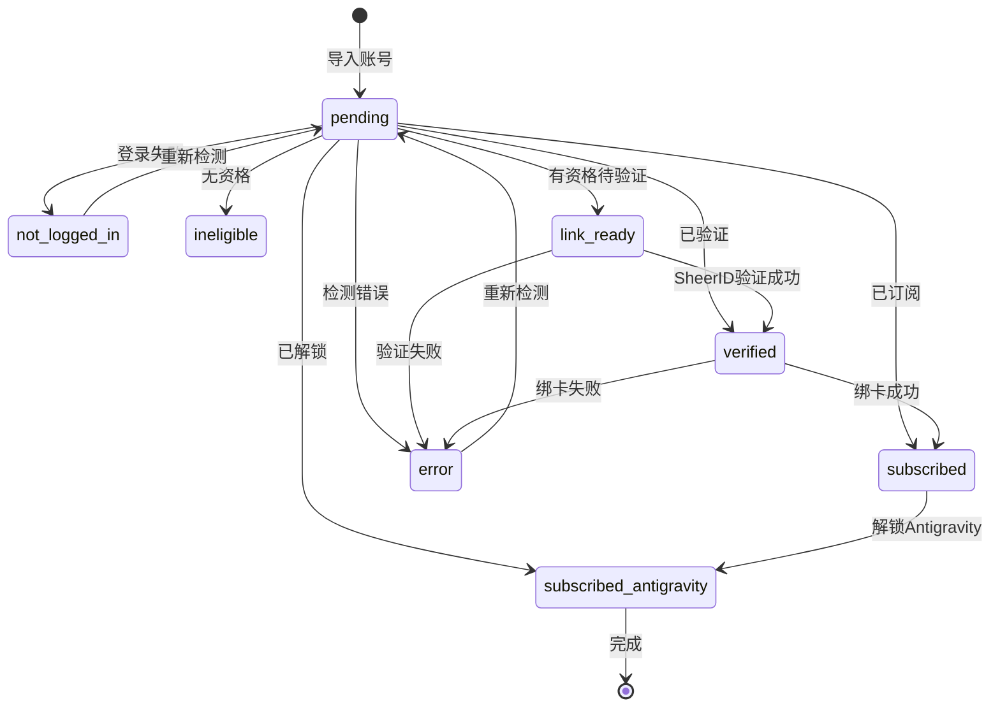

# 一键全自动处理流程图

## 整体流程概览

## 步骤状态定义

| 步骤代码 | 步骤名称 | 说明 |
|---------|---------|------|
| `init` | 初始化 | 获取账号、卡片、API信息 |
| `open_browser` | 打开浏览器 | 通过BitBrowser API打开浏览器 |
| `navigate` | 导航页面 | 导航到Google One资格页面 |
| `check_login` | 检测登录 | 检测是否已登录Google账号 |
| `do_login` | 执行登录 | 执行Google登录流程 |
| `handle_2fa` | 处理2FA | 处理两步验证 |
| `handle_backup` | 辅助邮箱 | 确认辅助邮箱验证 |
| `check_eligibility` | 检测资格 | 检测Google One学生资格 |
| `extract_link` | 提取链接 | 提取SheerID验证链接 |
| `verify_sheerid` | SheerID验证 | 调用API验证学生身份 |
| `bind_card` | 绑定卡片 | 填写并绑定支付卡 |
| `subscribe` | 订阅服务 | 完成订阅流程 |
| `complete` | 完成 | 流程结束 |

## 重试策略

| 操作 | 最大重试次数 | 重试间隔 | 说明 |
|-----|------------|---------|------|
| 打开浏览器 | 3 | 2秒 | 浏览器启动失败时重试 |
| 登录流程 | 3 | 1秒 | 登录失败时重试 |
| 2FA验证 | 5 | 30秒 | 等待TOTP码刷新 |
| 资格检测 | 2 | 3秒 | 页面加载问题重试 |
| SheerID验证 | 2 | 5秒 | API调用失败重试 |
| 绑卡操作 | 3 | 2秒 | iframe加载或输入问题 |
| 订阅操作 | 2 | 3秒 | 订阅按钮响应问题 |

## 错误处理

## 状态流转图

