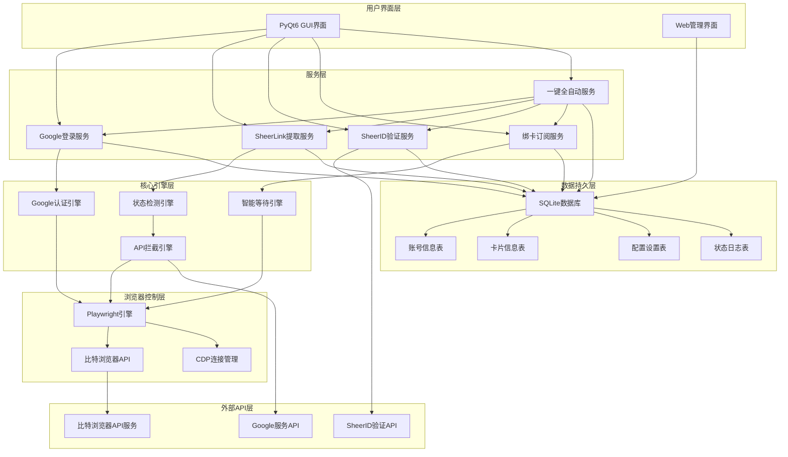
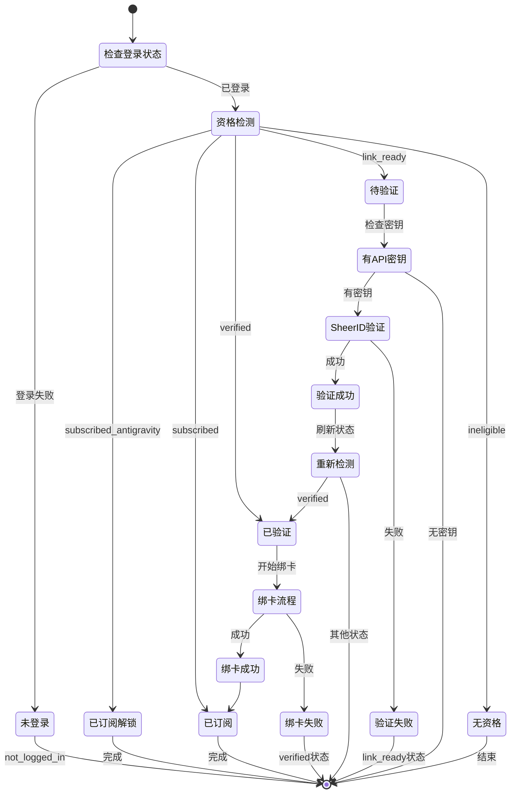

# 技术架构与API接口说明

## 系统技术架构

### 整体架构设计



### 技术栈说明

| 技术组件 | 版本要求 | 用途说明 |
|----------|----------|----------|
| Python | 3.8+ | 主要编程语言 |
| Playwright | 1.40+ | 浏览器自动化 |
| PyQt6 | 6.0+ | 桌面GUI框架 |
| SQLite | 3.35+ | 数据持久化 |
| Requests | 2.28+ | HTTP客户端 |
| AsyncIO | 内置 | 异步编程 |
| PYOTP | 2.8+ | 2FA代码生成 |
| Threading | 内置 | 多线程处理 |

## 模块详细设计

### 1. Google认证引擎 (google_auth.py)

#### 核心类设计

```python
class GoogleLoginStatus:
    """登录状态枚举"""
    LOGGED_IN = 'logged_in'      # 已登录
    NOT_LOGGED_IN = 'not_logged_in'  # 未登录  
    UNKNOWN = 'unknown'          # 未知状态
```

#### 主要函数接口

```python
async def get_login_state(page: Page, timeout: float = 5000) -> Tuple[str, Optional[str]]:
    """
    @brief 智能检测当前登录状态
    @param page Playwright页面对象
    @param timeout 检测超时时间(毫秒)
    @return (status, email) 状态和邮箱
    """

async def google_login(page: Page, account_info: dict) -> Tuple[bool, str]:
    """
    @brief 统一的Google登录函数
    @param page Playwright页面对象  
    @param account_info 账号信息字典
    @return (success, message) 成功状态和消息
    """
```

#### 账号信息数据结构

```python
account_info = {
    'email': str,           # 邮箱地址
    'password': str,        # 登录密码
    'backup': str,          # 辅助邮箱
    'backup_email': str,    # 备用邮箱(同backup)
    'secret': str,          # 2FA密钥
    '2fa_secret': str,      # 2FA密钥(同secret) 
    'secret_key': str       # 密钥(同secret)
}
```

### 2. Google登录服务 (google_login_service.py)

#### 服务类设计

```python
class GoogleLoginService:
    """Google登录服务封装类"""
    
    def __init__(self, log_callback: Callable[[str], None] = None):
        """初始化服务"""
        
    async def login_with_playwright(
        self, 
        page: Page, 
        account_info: dict,
        force_login: bool = False
    ) -> Tuple[bool, str, str]:
        """使用Playwright页面执行登录"""
        
    def login_browser_sync(
        self,
        browser_id: str,
        account_info: dict = None,
        target_url: str = None,
        close_after: bool = True
    ) -> Tuple[bool, str, str]:
        """同步方式登录比特浏览器"""
        
    async def batch_check_login_status(
        self,
        browser_ids: list,
        callback: Callable[[str, str, dict], None] = None
    ) -> Dict[str, Tuple[str, dict]]:
        """批量检查登录状态"""
```

#### 返回值规范

```python
# login_with_playwright 返回值
return_value = (
    success: bool,      # 是否成功
    status: str,        # 状态码 ('already_logged_in', 'login_success', etc.)
    message: str        # 详细消息
)

# batch_check_login_status 返回值  
return_dict = {
    'browser_id': (
        status: str,    # 登录状态
        info: dict      # 附加信息 {'email': 'user@example.com'}
    )
}
```

### 3. SheerLink提取服务 (sheerlink_service.py)

#### 服务类设计

```python
class SheerLinkService:
    """SheerID链接提取服务类"""
    
    def __init__(self, log_callback: Callable[[str], None] = None):
        """初始化服务"""
        
    async def extract_sheerlink_async(
        self,
        browser_id: str,
        account_info: dict = None
    ) -> Tuple[bool, str]:
        """异步提取SheerLink"""
        
    def extract_sheerlink_sync(
        self,
        browser_id: str, 
        account_info: dict = None
    ) -> Tuple[bool, str]:
        """同步提取SheerLink"""
        
    def extract_batch(
        self,
        browser_ids: List[str],
        thread_count: int = 1,
        callback: Callable[[str, bool, str], None] = None,
        stop_check: Callable[[], bool] = None
    ) -> Dict[str, any]:
        """批量提取SheerLink"""
```

#### 状态码定义

```python
# Google One资格状态
STATUS_SUBSCRIBED_ANTIGRAVITY = 'subscribed_antigravity'  # 已订阅+已解锁
STATUS_SUBSCRIBED = 'subscribed'                          # 已订阅
STATUS_VERIFIED = 'verified'                              # 已验证未绑卡
STATUS_LINK_READY = 'link_ready'                          # 有资格待验证
STATUS_INELIGIBLE = 'ineligible'                          # 无资格
STATUS_ERROR = 'error'                                    # 错误

# 状态显示映射
STATUS_DISPLAY = {
    'pending_check': '❔待检测',
    'not_logged_in': '🔒未登录', 
    'ineligible': '❌无资格',
    'link_ready': '🔗待验证',
    'verified': '✅已验证',
    'subscribed': '👑已订阅',
    'subscribed_antigravity': '🌟已解锁',
    'error': '⚠️错误'
}
```

#### 批量处理统计

```python
batch_stats = {
    'link_unverified': int,    # 未验证链接数量
    'link_verified': int,      # 已验证链接数量  
    'subscribed': int,         # 已订阅数量
    'ineligible': int,         # 无资格数量
    'timeout': int,            # 超时数量
    'error': int,              # 错误数量
    'total': int,              # 总数量
    'processed': int           # 已处理数量
}
```

### 4. SheerID验证器 (sheerid_verifier.py)

#### 验证器类设计

```python
class SheerIDVerifier:
    """SheerID验证器类"""
    
    def __init__(self, api_key: str = DEFAULT_API_KEY):
        """初始化验证器"""
        
    def _get_csrf_token(self) -> bool:
        """获取CSRF令牌"""
        
    def verify_batch(
        self, 
        verification_ids: List[str], 
        callback: Callable = None
    ) -> Dict:
        """批量验证"""
        
    def _poll_status(
        self, 
        check_token: str, 
        vid: str, 
        callback: Callable = None
    ) -> dict:
        """轮询验证状态"""
        
    def cancel_verification(self, verification_id: str) -> dict:
        """取消验证"""
```

#### API请求格式

```python
# 批量验证请求
batch_request = {
    "verificationIds": List[str],    # 验证ID列表
    "hCaptchaToken": str,           # API密钥
    "useLucky": bool,               # 是否使用幸运模式
    "programId": str                # 程序ID
}

# 状态轮询请求
poll_request = {
    "checkToken": str               # 检查令牌
}

# 取消验证请求
cancel_request = {
    "verificationId": str           # 验证ID
}
```

#### API响应格式

```python
# 验证响应  
verify_response = {
    "verificationId": str,          # 验证ID
    "currentStep": str,             # 当前步骤 ('pending'|'success'|'error')
    "message": str,                 # 响应消息
    "checkToken": str               # 轮询令牌(可选)
}

# 最终结果
final_result = {
    "status": str,                  # 最终状态
    "message": str,                 # 结果消息  
    "verificationId": str,          # 验证ID
    "currentStep": str              # 最终步骤
}
```

### 5. 绑卡订阅服务 (bind_card_service.py)

#### 卡片信息数据结构

```python
card_info = {
    'id': int,              # 卡片ID
    'number': str,          # 卡号
    'exp_month': str,       # 过期月份
    'exp_year': str,        # 过期年份  
    'cvv': str,            # CVV码
    'zip_code': str        # 邮编
}
```

#### 主要函数接口

```python
async def auto_bind_card(
    page: Page, 
    card_info: dict = None, 
    account_info: dict = None
) -> Tuple[bool, str]:
    """
    @brief 自动绑卡订阅
    @param page Playwright页面对象
    @param card_info 卡信息字典
    @param account_info 账号信息
    @return (success, message)
    """

def get_card_from_db() -> dict:
    """从数据库获取可用卡片"""
    
def update_card_usage(card_id: int):
    """更新卡片使用次数"""
```

#### 智能等待实现

```python
async def _smart_wait_for_any(
    page: Page, 
    locators: list, 
    timeout: int = DEFAULT_TIMEOUT
) -> Tuple[int, any]:
    """
    @brief 智能等待多个定位器
    @param page Playwright页面对象
    @param locators 定位器列表 [(name, locator), ...]
    @param timeout 超时时间
    @return (index, locator) 第一个出现的定位器
    """
```

### 6. 一键全自动服务 (all_in_one_service.py)

#### 主要函数接口

```python
def process_all_in_one(
    browser_id: str,
    api_key: str = '',
    card_info: dict = None,
    log_callback: Callable = None
) -> Tuple[bool, str, str]:
    """
    @brief 一键全自动处理
    @param browser_id 浏览器ID
    @param api_key SheerID API密钥
    @param card_info 卡片信息
    @param log_callback 日志回调
    @return (success, final_status, message)
    """
```

#### 状态流转图



## 数据库设计

### 账号表 (accounts)

```sql
CREATE TABLE accounts (
    id INTEGER PRIMARY KEY AUTOINCREMENT,
    browser_id TEXT UNIQUE NOT NULL,        -- 浏览器窗口ID
    email TEXT NOT NULL,                    -- 邮箱地址
    password TEXT,                          -- 登录密码
    recovery_email TEXT,                    -- 辅助邮箱
    secret_key TEXT,                        -- 2FA密钥
    status TEXT DEFAULT 'pending_check',    -- 当前状态
    sheerid_link TEXT,                      -- SheerID验证链接
    last_check_time DATETIME,               -- 最后检查时间
    created_at DATETIME DEFAULT CURRENT_TIMESTAMP,
    updated_at DATETIME DEFAULT CURRENT_TIMESTAMP
);
```

### 卡片表 (cards)

```sql
CREATE TABLE cards (
    id INTEGER PRIMARY KEY AUTOINCREMENT,
    card_number TEXT NOT NULL,              -- 卡号
    exp_month TEXT NOT NULL,                -- 过期月份
    exp_year TEXT NOT NULL,                 -- 过期年份
    cvv TEXT NOT NULL,                      -- CVV码
    zip_code TEXT,                          -- 邮编
    usage_count INTEGER DEFAULT 0,         -- 使用次数
    is_active BOOLEAN DEFAULT 1,           -- 是否可用
    created_at DATETIME DEFAULT CURRENT_TIMESTAMP
);
```

### 配置表 (settings)

```sql
CREATE TABLE settings (
    key TEXT PRIMARY KEY,                   -- 配置键
    value TEXT,                             -- 配置值
    description TEXT,                       -- 说明
    updated_at DATETIME DEFAULT CURRENT_TIMESTAMP
);
```

### 操作日志表 (operation_logs)

```sql
CREATE TABLE operation_logs (
    id INTEGER PRIMARY KEY AUTOINCREMENT,
    browser_id TEXT,                        -- 浏览器ID
    operation TEXT,                         -- 操作类型
    status TEXT,                            -- 操作状态
    message TEXT,                           -- 操作消息
    duration INTEGER,                       -- 操作耗时(秒)
    created_at DATETIME DEFAULT CURRENT_TIMESTAMP
);
```

## 配置管理

### 系统配置项

| 配置键 | 默认值 | 说明 |
|--------|--------|------|
| `sheerid_api_key` | 空 | SheerID API密钥 |
| `default_timeout` | 15000 | 默认超时时间(毫秒) |
| `max_retries` | 3 | 最大重试次数 |
| `batch_thread_count` | 5 | 批量处理线程数 |
| `auto_close_browser` | true | 自动关闭浏览器 |
| `enable_debug_screenshot` | false | 启用调试截图 |

### 配置管理接口

```python
class DBManager:
    @staticmethod
    def get_setting(key: str, default: str = '') -> str:
        """获取配置值"""
        
    @staticmethod  
    def set_setting(key: str, value: str, description: str = '') -> bool:
        """设置配置值"""
        
    @staticmethod
    def get_all_settings() -> Dict[str, str]:
        """获取所有配置"""
```

## API接口规范

### 比特浏览器API接口

```python
# 打开浏览器
def open_browser(browser_id: str) -> dict:
    """
    返回格式:
    {
        'success': bool,
        'msg': str,
        'data': {
            'ws': str,      # WebSocket端点
            'http': str,    # HTTP端点  
            'user_agent': str
        }
    }
    """

# 关闭浏览器
def close_browser(browser_id: str) -> dict:
    """
    返回格式:
    {
        'success': bool,
        'msg': str
    }
    """

# 获取浏览器信息
def get_browser_info(browser_id: str) -> dict:
    """
    返回格式:
    {
        'id': str,
        'name': str,
        'remark': str,
        'group_id': str,
        'user_agent': str
    }
    """
```

### SheerID API接口

```python
# API基础URL
BASE_URL = "https://batch.1key.me"

# 批量验证端点
POST /api/batch
Headers:
    Content-Type: application/json
    X-CSRF-Token: {csrf_token}
Body:
    {
        "verificationIds": ["vid1", "vid2"],
        "hCaptchaToken": "{api_key}",
        "useLucky": false,
        "programId": ""
    }

# 状态轮询端点  
POST /api/check-status
Headers:
    Content-Type: application/json
    X-CSRF-Token: {csrf_token}
Body:
    {
        "checkToken": "{check_token}"
    }
```

## 错误处理机制

### 错误分类

```python
class ErrorTypes:
    NETWORK_ERROR = 'network_error'         # 网络错误
    BROWSER_ERROR = 'browser_error'         # 浏览器错误
    ELEMENT_NOT_FOUND = 'element_not_found' # 元素未找到
    TIMEOUT_ERROR = 'timeout_error'         # 超时错误
    API_ERROR = 'api_error'                 # API错误
    AUTH_ERROR = 'auth_error'               # 认证错误
    DATA_ERROR = 'data_error'               # 数据错误
```

### 重试策略

```python
class RetryStrategy:
    """重试策略配置"""
    
    # 不同操作的重试次数
    RETRY_COUNTS = {
        'login': 3,                 # 登录重试3次
        'navigation': 2,            # 导航重试2次  
        'element_wait': 1,          # 元素等待重试1次
        'api_request': 3,           # API请求重试3次
        'csrf_token': 2             # CSRF令牌重试2次
    }
    
    # 重试间隔(秒)
    RETRY_DELAYS = {
        'login': 5,                 # 登录间隔5秒
        'navigation': 3,            # 导航间隔3秒
        'api_request': 2,           # API请求间隔2秒
        'default': 1                # 默认间隔1秒
    }
```

### 异常处理

```python
try:
    # 执行操作
    result = await operation()
except TimeoutError as e:
    # 超时处理
    logger.error(f"Operation timeout: {e}")
    return False, "timeout_error", str(e)
except PlaywrightError as e:
    # Playwright错误
    logger.error(f"Playwright error: {e}")
    return False, "browser_error", str(e)  
except requests.RequestException as e:
    # 网络请求错误
    logger.error(f"Request error: {e}")
    return False, "network_error", str(e)
except Exception as e:
    # 通用异常
    logger.error(f"Unexpected error: {e}")
    import traceback
    traceback.print_exc()
    return False, "unknown_error", str(e)
```

## 性能优化

### 并发控制

```python
import asyncio
from concurrent.futures import ThreadPoolExecutor

# 异步并发控制
semaphore = asyncio.Semaphore(5)  # 最大5个并发

async def process_with_semaphore(browser_id):
    async with semaphore:
        return await process_browser(browser_id)

# 线程池并发控制  
with ThreadPoolExecutor(max_workers=3) as executor:
    futures = [
        executor.submit(process_browser_sync, bid) 
        for bid in browser_ids
    ]
```

### 资源管理

```python
class ResourceManager:
    """资源管理器"""
    
    def __init__(self):
        self.browsers = {}      # 浏览器连接池
        self.sessions = {}      # HTTP会话池
        
    async def get_browser(self, browser_id: str):
        """获取浏览器连接(复用)"""
        
    def cleanup_browser(self, browser_id: str):
        """清理浏览器资源"""
        
    def cleanup_all(self):
        """清理所有资源"""
```

### 缓存机制

```python
import functools
import time

def cache_result(ttl_seconds=300):
    """结果缓存装饰器"""
    def decorator(func):
        cache = {}
        
        @functools.wraps(func)
        def wrapper(*args, **kwargs):
            key = str(args) + str(kwargs)
            now = time.time()
            
            if key in cache:
                result, timestamp = cache[key]
                if now - timestamp < ttl_seconds:
                    return result
            
            result = func(*args, **kwargs)
            cache[key] = (result, now)
            return result
            
        return wrapper
    return decorator

# 使用示例
@cache_result(ttl_seconds=600)  # 缓存10分钟
def get_browser_info(browser_id: str):
    """获取浏览器信息(带缓存)"""
    pass
```

## 监控与日志

### 日志配置

```python
import logging
from logging.handlers import RotatingFileHandler

# 配置日志格式
logging.basicConfig(
    level=logging.INFO,
    format='%(asctime)s - %(name)s - %(levelname)s - %(message)s',
    handlers=[
        # 控制台输出
        logging.StreamHandler(),
        # 文件输出(自动轮转)
        RotatingFileHandler(
            'logs/system.log', 
            maxBytes=10*1024*1024,  # 10MB
            backupCount=5
        )
    ]
)
```

### 性能监控

```python
import time
import functools

def monitor_performance(func):
    """性能监控装饰器"""
    @functools.wraps(func)
    async def wrapper(*args, **kwargs):
        start_time = time.time()
        try:
            result = await func(*args, **kwargs)
            success = True
            error_msg = None
        except Exception as e:
            result = None
            success = False
            error_msg = str(e)
            raise
        finally:
            duration = time.time() - start_time
            # 记录性能数据
            logger.info(f"Function {func.__name__} took {duration:.2f}s, success: {success}")
            
            # 可选：写入数据库
            # DBManager.log_operation(func.__name__, success, duration, error_msg)
            
        return result
    return wrapper
```

---

*最后更新: 2026-01-22*
