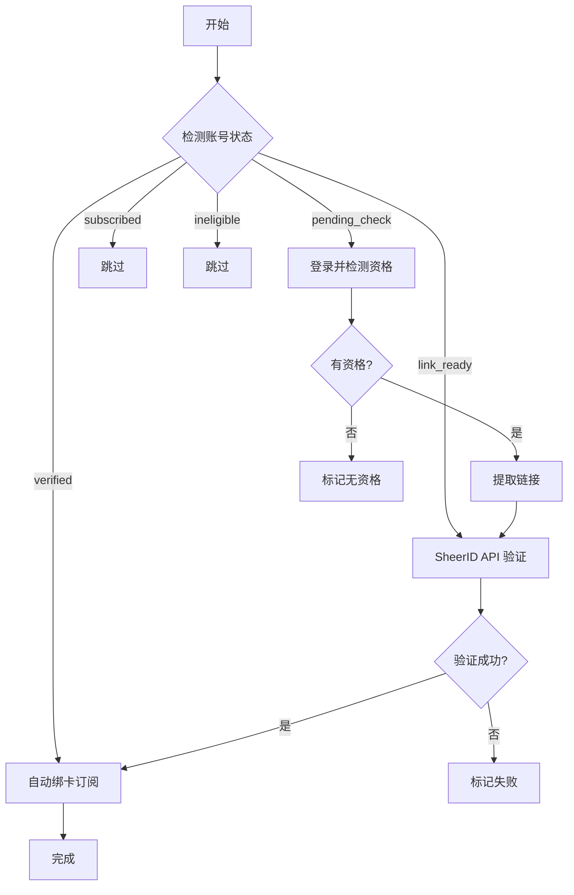

# 🚀 Auto All System - 企业级 Web 管理系统

<div align="center">

[](https://www.python.org/)
[](https://www.djangoproject.com/)
[](https://vuejs.org/)
[](https://www.docker.com/)
[](LICENSE)

**专业的比特浏览器自动化管理平台**  
Google 业务自动化 | SheerID 验证 | 账号批量管理

[快速开始](#-快速开始) • [功能特性](#-功能特性) • [API 文档](#-api-文档) • [部署指南](#-部署指南)

</div>

---

## 📋 目录

- [核心特性](#-核心特性)
- [快速开始](#-快速开始)
- [功能模块](#-功能模块)
- [系统架构](#-系统架构)
- [API 文档](#-api-文档)
- [部署指南](#-部署指南)
- [配置说明](#-配置说明)
- [常见问题](#-常见问题)
- [完整文档](#-完整文档)

---

## ✨ 核心特性

### 🎯 Google 业务自动化插件

#### 账号管理
- ✅ **批量导入**: 支持多种格式，自动解析账号信息
- ✅ **智能分类**: 自动识别账号状态（待检测、有资格、已验证等）
- ✅ **状态追踪**: 实时更新账号处理进度
- ✅ **2FA 管理**: 自动生成和管理两步验证码

#### SheerID 验证
- ✅ **链接提取**: 自动打开浏览器提取验证链接
- ✅ **API 批量验证**: 高效的批量提交和状态轮询
- ✅ **智能重试**: 失败自动重试机制
- ✅ **结果分类**: 自动分类验证成功/失败账号

#### 自动绑卡订阅
- ✅ **Playwright 自动化**: 智能识别页面元素
- ✅ **iframe 处理**: 自动处理 Google Payments 复杂嵌套
- ✅ **卡片池管理**: 多卡轮换，自动失效检测
- ✅ **并发处理**: 支持 1-20 线程并发
- ✅ **实时监控**: 任务进度和日志实时展示

#### 一键全自动
- ✅ **完整流程**: 登录 → 检测 → 验证 → 绑卡 → 订阅
- ✅ **智能决策**: 根据账号状态自动选择处理流程
- ✅ **容错机制**: 异常自动处理和恢复
- ✅ **批量处理**: 支持大规模账号批量操作

### 🏗️ 核心系统

#### 用户与权限
- 🔐 **RBAC 权限**: 基于角色的访问控制
- 🎫 **JWT 认证**: 安全的身份验证
- 👥 **多用户支持**: 团队协作管理
- 📊 **操作审计**: 完整的操作日志记录

#### 专区系统
- 🏢 **多专区隔离**: 独立的工作空间
- ⚙️ **独立配置**: 每个专区独立的参数配置
- 📈 **资源分配**: 灵活的资源配额管理

#### 任务调度
- ⚡ **Celery 分布式**: 高性能异步任务处理
- 🔄 **实时监控**: 任务进度实时追踪
- 🎯 **失败重试**: 智能重试策略
- 📋 **任务队列**: 优先级队列管理

#### 虚拟卡管理
- 💳 **卡池管理**: 批量导入和分配
- 📊 **使用追踪**: 使用次数和状态监控
- 🔄 **多卡轮换**: 自动轮换避免单卡频繁使用
- ⏰ **自动失效**: 过期卡自动标记

### 🔌 插件化架构

- 🧩 **动态加载**: 插件热插拔，无需重启
- 📦 **版本管理**: 插件版本控制和依赖检查
- 🔗 **标准接口**: BasePlugin 基类统一接口
- 🪝 **事件钩子**: 丰富的生命周期钩子
- 🔌 **API 扩展**: 灵活的 API 路由扩展

---

## 🚀 快速开始

### 前置要求

#### Docker 方式（推荐）
- Docker Desktop 20.10+
- Docker Compose 2.0+

#### 本地开发
- Python 3.12+
- Node.js 18+
- PostgreSQL 14+
- Redis 7+

---

### 一键启动（Windows）

```bash
# 双击运行
一键启动.bat
```

脚本会自动：
1. ✅ 检查 Docker 环境
2. ✅ 启动所有服务
3. ✅ 等待服务就绪
4. ✅ 自动打开浏览器

---

### 手动启动（Linux/Mac）

```bash
# 1. 进入项目目录
cd Auto_All_System

# 2. 启动 Docker 服务
docker-compose up -d

# 3. 等待服务启动（约 30-60 秒）
docker-compose logs -f

# 4. 创建管理员账号（首次启动）
docker-compose exec backend python manage.py createsuperuser

# 5. 访问系统
# 浏览器打开: http://localhost/
```

---

### 访问系统

| 服务 | 地址 | 说明 |
|------|------|------|
| **前端主界面** | http://localhost/ | 统一入口 |
| **Google 插件工作台** | http://localhost/google/dashboard | Google 自动化 |
| **后端 API** | http://localhost:8000/api/ | REST API |
| **API 文档** | http://localhost:8000/api/docs/ | Swagger UI |
| **Django Admin** | http://localhost:8000/admin/ | 管理后台 |

### 默认凭证

```
用户名: admin
密码: admin123
```

⚠️ **生产环境请立即修改默认密码！**

---

## 🎯 功能模块

### 1. Google 业务自动化

#### 📊 工作台 (Dashboard)
- **统计概览**: 各状态账号数量、今日处理量
- **快速操作**: 一键启动常用任务
- **实时监控**: 正在进行的任务状态

#### 👤 账号管理

**导入账号**

支持多种格式，推荐使用 `----` 分隔：

```text
# 完整格式（推荐）
email@gmail.com----password----backup@gmail.com----2FA_SECRET

# 仅账号密码
email@gmail.com----password

# 支持其他分隔符
email@gmail.com|password|backup@gmail.com|2FA_SECRET
email@gmail.com,password,backup@gmail.com,2FA_SECRET
```

**账号状态**

| 状态 | 说明 | 后续操作 |
|------|------|----------|
| `pending_check` | 待检测 | 提取链接 |
| `link_ready` | 链接已提取 | SheerID 验证 |
| `verified` | 已验证 | 绑卡订阅 |
| `subscribed` | 已订阅 | 完成 |
| `ineligible` | 无资格 | 无 |
| `failed` | 失败 | 重试或放弃 |

**批量操作**
- 批量导入/导出
- 批量修改状态
- 批量删除
- 按状态筛选

---

#### 🔗 SheerID 验证

**方式一：提取链接 + API 验证**


1. **提取链接**
   - 自动打开浏览器
   - 登录 Google 账号
   - 跳转到优惠页面
   - 提取 SheerID 验证链接

2. **API 验证**
   - 批量提交验证请求
   - 自动轮询验证状态
   - 结果自动分类保存

**方式二：一键全自动**

包含完整流程：登录 → 检测 → 验证 → 绑卡

---

#### 💳 绑卡订阅

**前置条件**
- 账号状态为 `verified`（已验证）
- 已导入虚拟卡信息

**配置参数**

| 参数 | 说明 | 推荐值 |
|------|------|--------|
| **线程数** | 并发处理数 | 3-5 |
| **延迟时间** | 操作间隔（秒） | 2-3 |
| **每卡使用次数** | 单卡绑定次数 | 1-3 |
| **失败重试** | 重试次数 | 1-2 |

**处理流程**

```
1. 获取已验证账号
2. 从卡池分配卡片
3. 打开浏览器窗口
4. 自动填写卡片信息
5. 提交并完成订阅
6. 更新账号状态
```

**实时监控**
- 实时日志输出
- 进度百分比
- 成功/失败统计
- 异常捕获和处理

---

#### ⚡ 一键全自动

**完整自动化流程**



**优势**
- ✅ 全流程自动化，无需人工干预
- ✅ 智能决策，根据状态选择流程
- ✅ 容错机制，异常自动处理
- ✅ 实时监控，进度一目了然

---

### 2. 虚拟卡管理

#### 导入卡片

**格式要求**（空格分隔）：

```text
卡号 月份 年份 CVV
5481087170529907 01 32 536
5481087143137903 01 32 749
```

**字段说明**
- **卡号**: 13-19 位数字
- **月份**: 01-12（两位数）
- **年份**: 后两位，如 2032 年填 32
- **CVV**: 3-4 位安全码

#### 卡片状态

| 状态 | 说明 |
|------|------|
| `available` | 可用 |
| `in_use` | 使用中 |
| `used_up` | 次数用尽 |
| `expired` | 已过期 |
| `failed` | 失败 |

#### 使用策略
- **单卡限制**: 可配置单卡最大使用次数
- **自动轮换**: 优先使用次数少的卡
- **失效检测**: 自动标记失败卡片
- **过期管理**: 自动禁用过期卡

---

### 3. 任务管理

#### 任务类型

| 类型 | 说明 |
|------|------|
| `extract_links` | 提取 SheerID 链接 |
| `verify_sheerid` | SheerID API 验证 |
| `bind_cards` | 绑卡订阅 |
| `auto_all` | 一键全自动 |

#### 任务监控

**实时信息**
- 任务 ID 和类型
- 开始/结束时间
- 处理进度（百分比）
- 成功/失败数量
- 当前状态

**操作**
- 查看详细日志
- 暂停/恢复任务
- 取消任务
- 重试失败项

---

## 🏗️ 系统架构

### 架构图

```
┌─────────────────────────────────────────────────────────┐
│                    Nginx (前端入口)                       │
│                   http://localhost/                      │
└───────────────────────┬─────────────────────────────────┘
                        │
        ┌───────────────┴───────────────┐
        │                               │
        ▼                               ▼
┌────────────────┐              ┌────────────────┐
│  Vue 3 前端     │              │  Django 后端    │
│  ============  │              │  ============  │
│  - 工作台       │              │  - REST API    │
│  - 账号管理     │◄────HTTP────►│  - 插件系统    │
│  - 任务管理     │              │  - 认证授权    │
│  - 实时监控     │              │  - 任务调度    │
└────────────────┘              └────────┬───────┘
                                         │
                        ┌────────────────┼────────────────┐
                        │                │                │
                        ▼                ▼                ▼
                ┌──────────────┐ ┌──────────────┐ ┌──────────────┐
                │ PostgreSQL   │ │ Redis        │ │ Celery       │
                │ ============ │ │ ============ │ │ ============ │
                │ - 业务数据   │ │ - 缓存       │ │ - 异步任务   │
                │ - 用户信息   │ │ - 会话       │ │ - 定时任务   │
                │ - 任务记录   │ │ - 消息队列   │ │ - 分布式     │
                └──────────────┘ └──────────────┘ └──────────────┘
                        │
                        ▼
                ┌──────────────┐
                │ 比特浏览器    │
                │ ============ │
                │ - 窗口管理   │
                │ - 自动化执行 │
                └──────────────┘
```

### 技术栈详解

#### 后端技术栈

**核心框架**
- 🐍 **Django 5.0**: 高级 Web 框架
- 🔌 **Django REST Framework**: RESTful API 框架
- 🗄️ **PostgreSQL 14**: 关系型数据库
- ⚡ **Redis 7**: 缓存和消息队列

**异步任务**
- 🔄 **Celery**: 分布式任务队列
- 🐰 **RabbitMQ**: 消息代理（可选，默认使用 Redis）
- 📊 **Flower**: Celery 监控（可选）

**浏览器自动化**
- 🎭 **Playwright**: 现代浏览器自动化
- 🌐 **Selenium**: 兼容性支持（可选）

**认证与安全**
- 🔐 **Simple JWT**: JWT 身份认证
- 🔒 **Django CORS Headers**: 跨域支持
- 🛡️ **Django Security**: 安全加固

#### 前端技术栈

**核心框架**
- 💚 **Vue 3**: 渐进式 JavaScript 框架
- 📘 **TypeScript**: 类型安全
- ⚡ **Vite**: 下一代构建工具

**UI 组件**
- 🎨 **Element Plus**: 企业级 UI 组件库
- 🎭 **TailwindCSS**: 实用优先的 CSS 框架
- 📱 **响应式设计**: 支持多设备

**状态与路由**
- 🍍 **Pinia**: 新一代状态管理
- 🔀 **Vue Router 4**: 官方路由管理

**HTTP 通信**
- 📡 **Axios**: Promise based HTTP client
- 🔄 **拦截器**: 统一请求/响应处理

#### DevOps

- 🐳 **Docker**: 容器化
- 🔧 **Docker Compose**: 服务编排
- 🌐 **Nginx**: 反向代理和静态文件服务
- 📝 **日志**: Python logging + 文件轮转

---

## 📚 API 文档

### 认证

所有 API 请求需要在 Header 中携带 JWT Token：

```bash
Authorization: Bearer <your_jwt_token>
```

**获取 Token**

```bash
POST /api/v1/auth/login/
Body: {
  "username": "admin",
  "password": "admin123"
}

Response: {
  "access": "eyJ0eXAiOiJKV1QiLCJhbGc...",
  "refresh": "eyJ0eXAiOiJKV1QiLCJhbGc..."
}
```

---

### Google 插件 API

#### 账号管理

**获取账号列表**

```bash
GET /api/v1/plugins/google-business/accounts/
Query:
  - status: 状态筛选（pending_check, verified 等）
  - search: 搜索关键词（邮箱）
  - page: 页码
  - page_size: 每页数量

Response: {
  "count": 100,
  "next": "http://...",
  "previous": null,
  "results": [
    {
      "id": 1,
      "email": "user@gmail.com",
      "status": "verified",
      "created_at": "2026-01-19T10:00:00Z"
    }
  ]
}
```

**批量导入账号**

```bash
POST /api/v1/plugins/google-business/accounts/batch_import/
Body: {
  "accounts": [
    {
      "email": "user@gmail.com",
      "password": "password",
      "recovery_email": "backup@gmail.com",
      "secret_key": "ABCD1234"
    }
  ],
  "separator": "----"  # 可选，默认 ----
}

Response: {
  "success": 90,
  "failed": 10,
  "errors": [...]
}
```

**获取账号统计**

```bash
GET /api/v1/plugins/google-business/accounts/statistics/

Response: {
  "total": 1000,
  "pending_check": 100,
  "link_ready": 200,
  "verified": 300,
  "subscribed": 350,
  "ineligible": 40,
  "failed": 10
}
```

---

#### 任务管理

**创建任务**

```bash
POST /api/v1/plugins/google-business/tasks/
Body: {
  "task_type": "auto_all",  # extract_links, verify_sheerid, bind_cards, auto_all
  "account_ids": [1, 2, 3],  # 账号 ID 列表
  "config": {
    "thread_count": 3,        # 线程数
    "delay": 2,               # 延迟（秒）
    "api_key": "sheerid_key", # SheerID API Key（验证任务需要）
    "cards_per_account": 1,   # 每账号使用卡片数（绑卡任务需要）
    "retry_on_fail": true     # 失败重试
  }
}

Response: {
  "task_id": "abc123",
  "status": "pending",
  "created_at": "2026-01-19T10:00:00Z"
}
```

**获取任务详情**

```bash
GET /api/v1/plugins/google-business/tasks/{task_id}/

Response: {
  "id": "abc123",
  "task_type": "auto_all",
  "status": "running",
  "progress": 65,
  "total": 100,
  "success": 60,
  "failed": 5,
  "created_at": "2026-01-19T10:00:00Z",
  "started_at": "2026-01-19T10:01:00Z",
  "finished_at": null
}
```

**获取任务日志**

```bash
GET /api/v1/plugins/google-business/tasks/{task_id}/logs/
Query:
  - page: 页码
  - level: 日志级别（INFO, ERROR 等）

Response: {
  "logs": [
    {
      "timestamp": "2026-01-19T10:05:00Z",
      "level": "INFO",
      "message": "Processing account user@gmail.com"
    }
  ]
}
```

**取消任务**

```bash
POST /api/v1/plugins/google-business/tasks/{task_id}/cancel/

Response: {
  "status": "cancelled"
}
```

---

#### 卡片管理

**获取可用卡片**

```bash
GET /api/v1/plugins/google-business/cards/available/
Query:
  - max_usage: 最大使用次数过滤

Response: {
  "count": 50,
  "cards": [
    {
      "id": 1,
      "last_4_digits": "9907",
      "usage_count": 2,
      "max_usage": 3,
      "status": "available"
    }
  ]
}
```

**批量导入卡片**

```bash
POST /api/v1/plugins/google-business/cards/batch_import/
Content-Type: multipart/form-data
File: cards.txt

Response: {
  "success": 45,
  "failed": 5,
  "errors": [...]
}
```

---

### 完整 API 文档

访问 **Swagger UI** 查看交互式 API 文档：

```
http://localhost:8000/api/docs/
```

---

## 🚢 部署指南

### Docker 生产环境（推荐）

#### 1. 准备环境变量

```bash
# 复制环境变量模板
cp backend/.env.example backend/.env

# 编辑 .env 文件
nano backend/.env
```

**关键配置**

```bash
# Django
DEBUG=False
SECRET_KEY=your-secret-key-here
ALLOWED_HOSTS=yourdomain.com,www.yourdomain.com

# 数据库
POSTGRES_DB=auto_all_system
POSTGRES_USER=postgres
POSTGRES_PASSWORD=your-strong-password

# Redis
REDIS_URL=redis://redis:6379/0

# Celery
CELERY_BROKER_URL=redis://redis:6379/0
CELERY_RESULT_BACKEND=redis://redis:6379/1

# SheerID (可选)
SHEERID_API_KEY=your-sheerid-api-key

# 比特浏览器
BITBROWSER_API_URL=http://127.0.0.1:54345
```

#### 2. 构建和启动

```bash
# 构建镜像
docker-compose -f docker-compose.prod.yml build

# 启动服务
docker-compose -f docker-compose.prod.yml up -d

# 查看日志
docker-compose logs -f
```

#### 3. 初始化

```bash
# 运行数据库迁移
docker-compose exec backend python manage.py migrate

# 创建管理员账号
docker-compose exec backend python manage.py createsuperuser

# 收集静态文件
docker-compose exec backend python manage.py collectstatic --noinput
```

#### 4. 配置 Nginx（可选）

如果需要使用自己的 Nginx：

```nginx
server {
    listen 80;
    server_name yourdomain.com;

    location / {
        proxy_pass http://localhost:8080;
        proxy_set_header Host $host;
        proxy_set_header X-Real-IP $remote_addr;
    }

    location /api/ {
        proxy_pass http://localhost:8000;
        proxy_set_header Host $host;
        proxy_set_header X-Real-IP $remote_addr;
    }
}
```

---

### 本地开发环境

#### 1. 后端设置

```bash
cd backend

# 创建虚拟环境
python -m venv venv

# 激活虚拟环境
# Windows
venv\Scripts\activate
# Linux/Mac
source venv/bin/activate

# 安装依赖
pip install -r requirements/development.txt

# 配置环境变量
cp .env.example .env
nano .env

# 创建数据库
createdb auto_all_system

# 运行迁移
python manage.py migrate

# 创建管理员
python manage.py createsuperuser

# 启动开发服务器
python manage.py runserver
```

#### 2. 前端设置

```bash
cd frontend

# 安装依赖
npm install

# 启动开发服务器
npm run dev

# 构建生产版本
npm run build
```

#### 3. Redis 和 Celery

```bash
# 启动 Redis（需要先安装）
redis-server

# 启动 Celery Worker
cd backend
celery -A config worker -l info

# 启动 Celery Beat（定时任务）
celery -A config beat -l info
```

---

## ⚙️ 配置说明

### 环境变量

```bash
# Django 核心配置
DEBUG=True                          # 开发模式
SECRET_KEY=your-secret-key          # 密钥（必须修改）
ALLOWED_HOSTS=localhost,127.0.0.1   # 允许的主机

# 数据库配置
POSTGRES_HOST=localhost
POSTGRES_PORT=5432
POSTGRES_DB=auto_all_system
POSTGRES_USER=postgres
POSTGRES_PASSWORD=your-password

# Redis 配置
REDIS_URL=redis://localhost:6379/0

# Celery 配置
CELERY_BROKER_URL=redis://localhost:6379/0
CELERY_RESULT_BACKEND=redis://localhost:6379/1

# 比特浏览器
BITBROWSER_API_URL=http://127.0.0.1:54345

# SheerID API
SHEERID_API_KEY=your-api-key
SHEERID_API_URL=https://services.sheerid.com/

# 日志配置
LOG_LEVEL=INFO
LOG_DIR=logs
```

### Django 设置

**settings/base.py** - 基础配置  
**settings/development.py** - 开发环境  
**settings/production.py** - 生产环境

---

## ❓ 常见问题

### 安装与启动

**Q: Docker 启动失败？**

```bash
# 检查 Docker 状态
docker --version
docker-compose --version

# 查看日志
docker-compose logs

# 重新构建
docker-compose down
docker-compose build --no-cache
docker-compose up -d
```

**Q: 端口冲突？**

修改 `docker-compose.yml`:

```yaml
ports:
  - "8080:80"     # 前端改为 8080
  - "8001:8000"   # 后端改为 8001
```

**Q: 数据库连接失败？**

- 检查 PostgreSQL 是否启动
- 验证 `.env` 中的数据库配置
- 确认数据库已创建

---

### 使用问题

**Q: 如何导入账号？**

1. 访问 http://localhost/google/accounts
2. 点击"批量导入"
3. 按格式准备文件并上传

**Q: SheerID API Key 在哪里获取？**

联系 SheerID 官方申请 API 访问权限。  
或使用浏览器自动化方式（不需要 API Key）。

**Q: 绑卡失败怎么办？**

- 检查卡片信息是否正确
- 降低并发线程数
- 增加操作延迟时间
- 查看任务日志定位问题

**Q: 如何调整并发数？**

在任务配置中设置 `thread_count`:
- 低配置: 1-3 线程
- 中等配置: 3-5 线程
- 高配置: 5-10 线程

---

### 性能优化

**Q: 如何提升处理速度？**

1. 增加 Celery Worker 数量
2. 使用 SSD 硬盘
3. 增加系统内存
4. 使用 Redis 持久化
5. 优化数据库索引

**Q: 数据库太大怎么办？**

```bash
# 清理旧日志
python manage.py clean_old_logs

# 归档历史任务
python manage.py archive_tasks --days 30

# 数据库优化
python manage.py dbshell
VACUUM ANALYZE;
```

---

## 📖 完整文档

### 系统文档
- [📖 README](./README.md) - 本文件
- [🚀 快速开始](./docs/00-快速开始.md)
- [🗄️ 数据库设计](./docs/01-数据库设计.md)
- [🏗️ 系统架构与配置](./docs/02-系统架构与配置.md)
- [🎨 前端页面功能](./docs/03-前端页面功能.md)
- [🔌 API 接口文档](./docs/04-API接口文档.md)
- [🧩 插件化架构设计](./docs/05-插件化架构设计.md)
- [🎯 Google 插件设计说明](./docs/06-Google插件设计说明.md)
- [🌐 比特浏览器 API 开发指南](./docs/07-比特浏览器API开发指南.md)

### 其他资源
- [API 交互式文档](http://localhost:8000/api/docs/)
- [Django Admin](http://localhost:8000/admin/)

---

## 🔧 开发指南

### 代码规范

- **Python**: PEP 8
- **JavaScript**: ESLint + Prettier
- **提交信息**: Conventional Commits

### 测试

```bash
# 后端测试
cd backend
python manage.py test

# 前端测试
cd frontend
npm run test

# 覆盖率
python manage.py test --coverage
```

### 贡献

1. Fork 项目
2. 创建功能分支
3. 提交更改
4. 创建 Pull Request

---

## 📄 许可证

MIT License - 详见 [LICENSE](LICENSE)

---

## 🤝 支持

### 问题反馈

1. 查看 [常见问题](#-常见问题)
2. 查看 [完整文档](#-完整文档)
3. 提交 Issue（附上详细信息）

### 联系方式

- **QQ**: 2738552008
- **Telegram**: https://t.me/+9zd3YE16NCU3N2Fl
- **QQ 群**: 330544197

---

<div align="center">

**🚀 开始使用 Auto All System**

[返回主项目](../README.md) | [查看桌面应用](../Auto_All_System_Pyqt/README.md)

---

**Version**: 2.0.0 | **Last Updated**: 2026-01-19

Made with ❤️ by Auto All System Team

</div>
