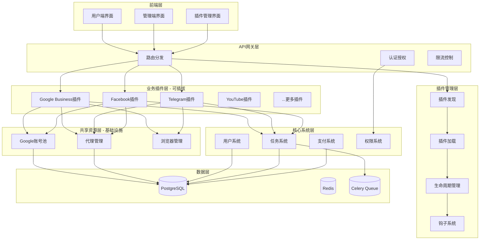
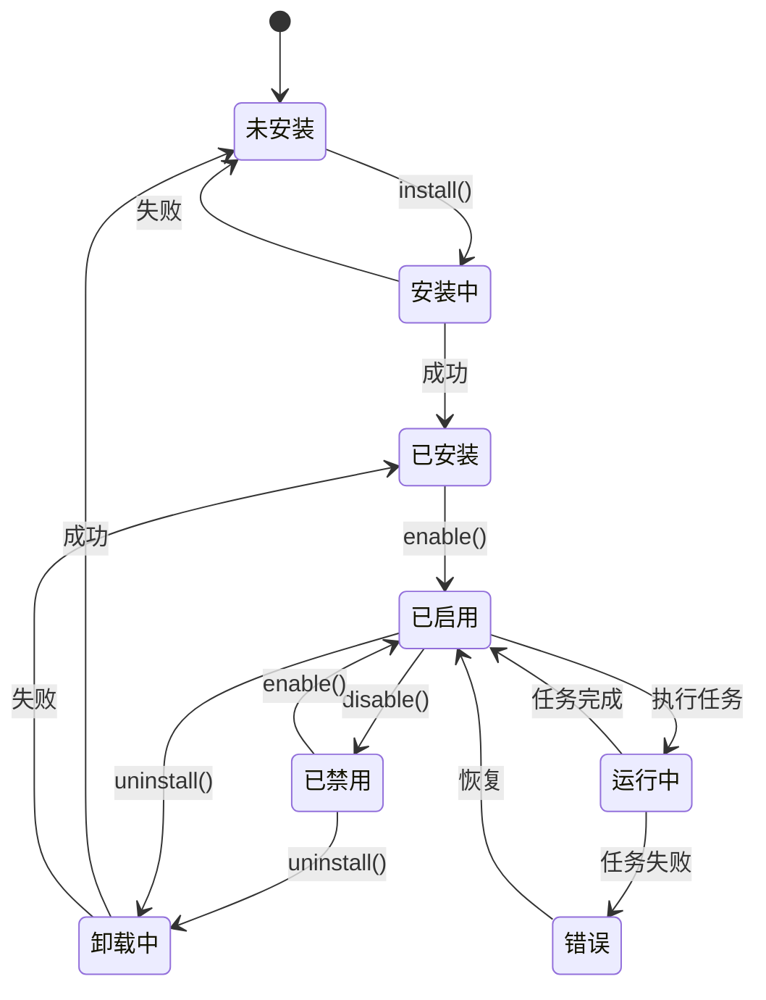
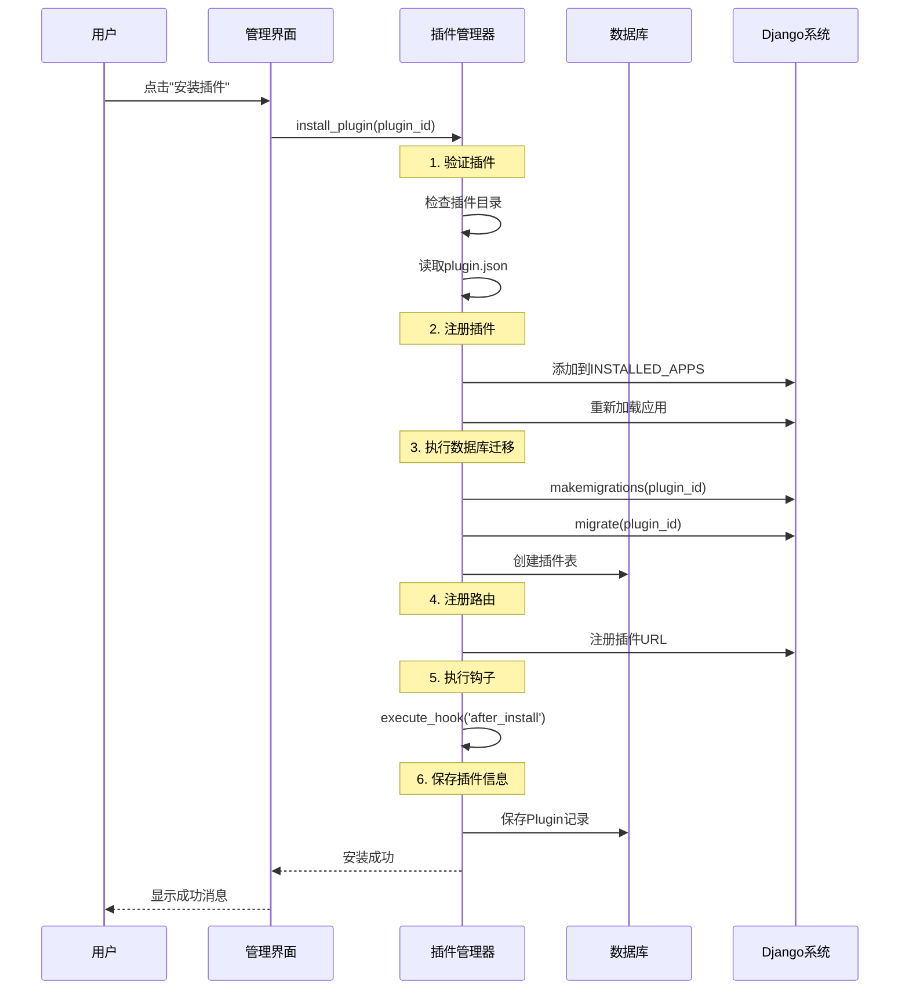
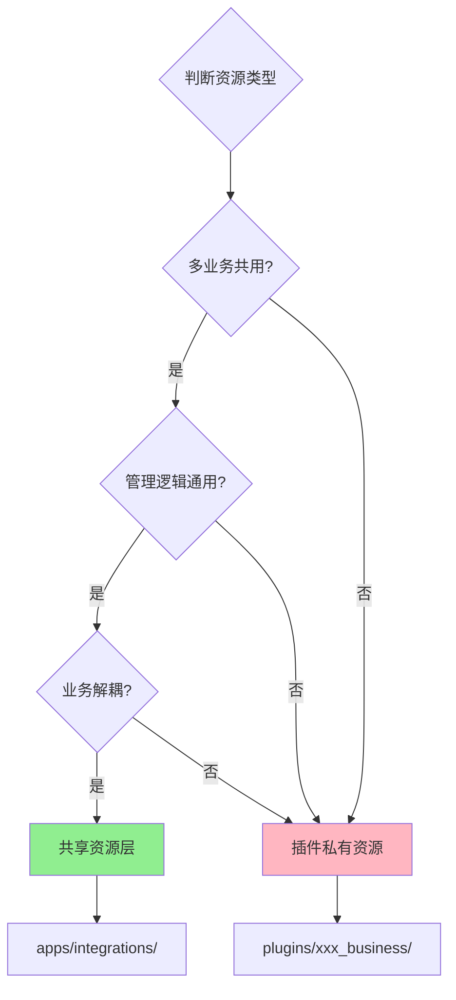
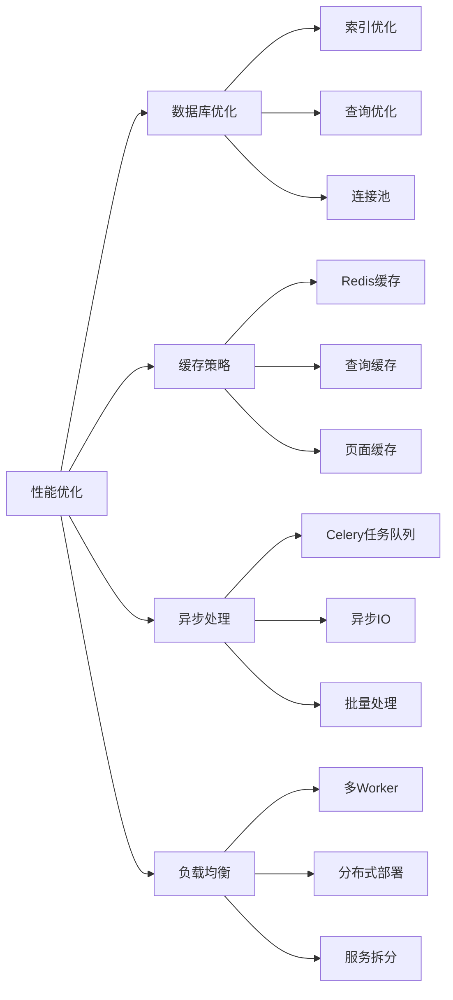

# 插件化架构设计

## 📋 文档概述

**项目名称**: Auto All System  
**架构版本**: v2.0  
**更新日期**: 2026-01-17

---

## 🎯 设计目标

### 核心目标
1. **业务模块可插拔** - 可以动态安装/卸载业务插件
2. **数据库动态扩展** - 插件可以自动创建和管理自己的数据表
3. **第三方业务快速接入** - 提供标准化的插件开发框架
4. **系统灵活可扩展** - 支持无限扩展业务类型

### 设计原则
- **高内聚低耦合** - 插件之间独立，不相互依赖
- **标准化接口** - 统一的插件规范和API接口
- **安全隔离** - 插件数据和代码互不影响
- **易于维护** - 清晰的目录结构和文档

---

## 🏗️ 整体架构

### 系统分层



---

## 📂 目录结构设计

### 完整目录结构

```
Auto_All_System/
├── backend/
│   ├── apps/                          # 核心应用层
│   │   ├── accounts/                 # 用户系统
│   │   ├── tasks/                    # 任务系统
│   │   ├── zones/                    # 专区系统（兼容旧版）
│   │   ├── cards/                    # 虚拟卡系统
│   │   ├── payments/                 # 支付订单
│   │   │
│   │   ├── integrations/             # 🏗️ 共享资源层（基础设施）
│   │   │   ├── proxies/             # 代理管理
│   │   │   │   ├── models.py
│   │   │   │   ├── views.py
│   │   │   │   ├── serializers.py
│   │   │   │   └── urls.py
│   │   │   │
│   │   │   ├── google_accounts/     # Google账号池
│   │   │   │   ├── models.py
│   │   │   │   ├── views.py
│   │   │   │   ├── serializers.py
│   │   │   │   └── urls.py
│   │   │   │
│   │   │   ├── bitbrowser/          # ⭐ 比特浏览器完整API封装
│   │   │   │   ├── __init__.py
│   │   │   │   ├── api.py           # 完整API封装 (BitBrowserAPI)
│   │   │   │   ├── models.py
│   │   │   │   └── migrations/
│   │   │   │
│   │   │   └── browsers/            # 浏览器抽象层（未来扩展）
│   │   │       ├── __init__.py
│   │   │       ├── base.py          # 浏览器基类
│   │   │       ├── bitbrowser.py    # BitBrowser适配器
│   │   │       ├── adspower.py      # AdsPower实现
│   │   │       └── manager.py       # 浏览器管理器
│   │   │
│   │   ├── plugins/                  # 🔧 插件管理系统
│   │   │   ├── models.py            # Plugin, PluginHook, PluginConfig
│   │   │   ├── manager.py           # 插件管理器
│   │   │   ├── loader.py            # 插件加载器
│   │   │   ├── hooks.py             # 钩子系统
│   │   │   ├── views.py             # 插件管理API
│   │   │   ├── serializers.py
│   │   │   └── urls.py
│   │   │
│   │   └── admin_panel/              # 管理后台
│   │
│   ├── plugins/                      # 🎯 业务插件层（可插拔）
│   │   │
│   │   ├── google_business/          # Google业务插件
│   │   │   ├── __init__.py
│   │   │   ├── plugin.json          # 插件配置
│   │   │   ├── models.py            # 数据模型
│   │   │   │   ├── SheerIDVerification
│   │   │   │   └── GeminiSubscription
│   │   │   ├── workflows.py         # 业务流程
│   │   │   │   ├── SheerIDWorkflow
│   │   │   │   └── GeminiWorkflow
│   │   │   ├── views.py             # API视图
│   │   │   ├── serializers.py
│   │   │   ├── urls.py
│   │   │   ├── hooks.py             # 钩子实现
│   │   │   └── migrations/          # 数据库迁移
│   │   │       └── 0001_initial.py
│   │   │
│   │   ├── telegram_business/        # Telegram业务插件
│   │   │   ├── __init__.py
│   │   │   ├── plugin.json
│   │   │   ├── models.py
│   │   │   │   ├── TelegramAccount
│   │   │   │   ├── TelegramGroup
│   │   │   │   └── TelegramTask
│   │   │   ├── workflows.py
│   │   │   ├── views.py
│   │   │   ├── serializers.py
│   │   │   ├── urls.py
│   │   │   └── migrations/
│   │   │
│   │   ├── facebook_business/        # Facebook业务插件
│   │   │   ├── __init__.py
│   │   │   ├── plugin.json
│   │   │   ├── models.py
│   │   │   │   ├── FacebookPage
│   │   │   │   ├── FacebookAd
│   │   │   │   └── FacebookTask
│   │   │   ├── workflows.py
│   │   │   ├── views.py
│   │   │   └── migrations/
│   │   │
│   │   └── youtube_business/         # YouTube业务插件
│   │       ├── __init__.py
│   │       ├── plugin.json
│   │       ├── models.py
│   │       │   ├── YouTubeChannel
│   │       │   └── YouTubeVideo
│   │       ├── workflows.py
│   │       ├── views.py
│   │       └── migrations/
│   │
│   ├── config/                       # 项目配置
│   │   ├── settings/
│   │   │   ├── base.py
│   │   │   ├── development.py
│   │   │   └── production.py
│   │   ├── urls.py                  # 主路由（包含插件路由）
│   │   └── celery.py
│   │
│   ├── core/                         # 核心工具
│   │   ├── utils/
│   │   ├── exceptions.py
│   │   └── permissions.py
│   │
│   └── manage.py
│
├── frontend/
│   ├── src/
│   │   ├── views/
│   │   │   ├── plugins/             # 插件管理界面
│   │   │   │   ├── PluginList.vue
│   │   │   │   ├── PluginDetail.vue
│   │   │   │   └── PluginInstall.vue
│   │   │   │
│   │   │   ├── google/              # Google插件界面
│   │   │   │   ├── SheerIDManage.vue
│   │   │   │   └── GeminiManage.vue
│   │   │   │
│   │   │   └── telegram/            # Telegram插件界面
│   │   │       ├── AccountManage.vue
│   │   │       └── GroupManage.vue
│   │   │
│   │   ├── api/
│   │   │   ├── plugins.ts           # 插件管理API
│   │   │   ├── google.ts            # Google插件API
│   │   │   └── telegram.ts          # Telegram插件API
│   │   │
│   │   └── router/
│   │       ├── index.ts
│   │       └── plugins.ts           # 插件路由（动态加载）
│   │
│   └── package.json
│
├── 文档/
│   ├── 00-快速开始.md
│   ├── 01-数据库设计文档.md
│   ├── 02-系统架构与配置.md
│   ├── 03-前端页面功能说明.md
│   ├── 04-API接口文档.md
│   ├── 05-API对接报告.md
│   ├── 06-开发计划.md               # 本文档
│   ├── 07-插件化架构设计.md          # 架构设计
│   ├── 08-技术栈说明.md
│   └── 09-插件开发指南.md            # 待创建
│
└── docker-compose.yml
```

---

## 🔌 插件系统设计

### 插件生命周期



### 插件安装流程



### 插件配置文件

**plugin.json 结构**:

```json
{
  "id": "google_business",
  "name": "Google Business Plugin",
  "version": "1.0.0",
  "author": "Auto All System Team",
  "description": "Google业务自动化插件，支持SheerID学生验证、Gemini订阅等功能",
  "homepage": "https://github.com/auto-all-system/google-business-plugin",
  
  "django_app": "plugins.google_business",
  
  "dependencies": {
    "python": ">=3.10",
    "django": ">=5.0",
    "required_plugins": [],
    "required_packages": [
      "selenium>=4.0",
      "pillow>=10.0"
    ]
  },
  
  "database": {
    "models": [
      "SheerIDVerification",
      "GeminiSubscription",
      "GoogleBusinessTask"
    ],
    "migrations": true
  },
  
  "api": {
    "url_prefix": "/api/plugins/google-business",
    "urls_module": "plugins.google_business.urls"
  },
  
  "frontend": {
    "routes": [
      {
        "path": "/plugins/google-business",
        "component": "GoogleBusinessDashboard",
        "meta": {
          "title": "Google业务管理",
          "icon": "google",
          "requiresAuth": true
        }
      }
    ],
    "menu": [
      {
        "title": "Google业务",
        "icon": "google",
        "children": [
          {
            "title": "SheerID验证",
            "path": "/plugins/google-business/sheerid",
            "icon": "verification"
          },
          {
            "title": "Gemini订阅",
            "path": "/plugins/google-business/gemini",
            "icon": "subscription"
          },
          {
            "title": "任务管理",
            "path": "/plugins/google-business/tasks",
            "icon": "task"
          }
        ]
      }
    ]
  },
  
  "hooks": {
    "before_install": "hooks.before_install",
    "after_install": "hooks.after_install",
    "before_uninstall": "hooks.before_uninstall",
    "after_uninstall": "hooks.after_uninstall",
    "on_enable": "hooks.on_enable",
    "on_disable": "hooks.on_disable"
  },
  
  "permissions": [
    "google_business.view_verification",
    "google_business.add_verification",
    "google_business.change_verification",
    "google_business.delete_verification"
  ],
  
  "settings": {
    "max_concurrent_tasks": {
      "type": "integer",
      "default": 5,
      "description": "最大并发任务数"
    },
    "retry_times": {
      "type": "integer",
      "default": 3,
      "description": "失败重试次数"
    },
    "enable_notification": {
      "type": "boolean",
      "default": true,
      "description": "启用任务通知"
    }
  }
}
```

---

## 🔧 核心组件设计

### 1. 插件管理器

```python
# apps/plugins/manager.py

from typing import Dict, List, Optional
from django.apps import apps
from django.conf import settings
from django.core.management import call_command
import json
import os

class PluginManager:
    """插件管理器 - 负责插件的发现、加载、安装、卸载"""
    
    _instance = None
    _plugins: Dict[str, 'PluginInfo'] = {}
    
    def __new__(cls):
        if cls._instance is None:
            cls._instance = super().__new__(cls)
        return cls._instance
    
    @classmethod
    def discover_plugins(cls) -> List[str]:
        """发现所有可用的插件"""
        plugins_dir = os.path.join(settings.BASE_DIR, 'plugins')
        plugins = []
        
        for item in os.listdir(plugins_dir):
            plugin_path = os.path.join(plugins_dir, item)
            config_file = os.path.join(plugin_path, 'plugin.json')
            
            if os.path.isdir(plugin_path) and os.path.exists(config_file):
                plugins.append(item)
        
        return plugins
    
    @classmethod
    def load_plugin_config(cls, plugin_id: str) -> dict:
        """加载插件配置"""
        config_file = os.path.join(
            settings.BASE_DIR, 'plugins', plugin_id, 'plugin.json'
        )
        
        with open(config_file, 'r', encoding='utf-8') as f:
            return json.load(f)
    
    @classmethod
    def install_plugin(cls, plugin_id: str) -> Dict:
        """
        安装插件
        
        步骤:
        1. 验证插件
        2. 检查依赖
        3. 注册到INSTALLED_APPS
        4. 执行数据库迁移
        5. 注册路由
        6. 执行安装钩子
        7. 保存插件记录
        """
        from .models import Plugin
        from .hooks import HookManager
        
        # 1. 验证插件
        plugin_path = os.path.join(settings.BASE_DIR, 'plugins', plugin_id)
        if not os.path.exists(plugin_path):
            return {'success': False, 'error': f'Plugin not found: {plugin_id}'}
        
        # 2. 加载配置
        config = cls.load_plugin_config(plugin_id)
        
        # 3. 检查依赖
        dependency_check = cls._check_dependencies(config.get('dependencies', {}))
        if not dependency_check['success']:
            return dependency_check
        
        # 4. 执行 before_install 钩子
        HookManager.execute_hook(plugin_id, 'before_install', config)
        
        # 5. 注册到INSTALLED_APPS
        app_label = config['django_app']
        if app_label not in settings.INSTALLED_APPS:
            settings.INSTALLED_APPS += (app_label,)
            apps.app_configs = {}
            apps.populate(settings.INSTALLED_APPS)
        
        # 6. 执行数据库迁移
        try:
            call_command('makemigrations', plugin_id, interactive=False)
            call_command('migrate', plugin_id, interactive=False)
        except Exception as e:
            return {
                'success': False,
                'error': f'Migration failed: {str(e)}'
            }
        
        # 7. 注册路由
        cls._register_routes(plugin_id, config)
        
        # 8. 保存插件记录
        plugin, created = Plugin.objects.get_or_create(
            plugin_id=plugin_id,
            defaults={
                'name': config['name'],
                'version': config['version'],
                'description': config.get('description', ''),
                'config': config,
                'is_enabled': True,
            }
        )
        
        # 9. 执行 after_install 钩子
        HookManager.execute_hook(plugin_id, 'after_install', config)
        
        return {
            'success': True,
            'plugin_id': plugin_id,
            'plugin_name': config['name'],
            'version': config['version'],
            'tables_created': cls._get_plugin_tables(plugin_id)
        }
    
    @classmethod
    def uninstall_plugin(cls, plugin_id: str, remove_data: bool = False) -> Dict:
        """
        卸载插件
        
        参数:
            plugin_id: 插件ID
            remove_data: 是否删除数据表
        """
        from .models import Plugin
        from .hooks import HookManager
        
        try:
            plugin = Plugin.objects.get(plugin_id=plugin_id)
        except Plugin.DoesNotExist:
            return {'success': False, 'error': 'Plugin not found'}
        
        config = cls.load_plugin_config(plugin_id)
        
        # 1. 执行 before_uninstall 钩子
        HookManager.execute_hook(plugin_id, 'before_uninstall', config)
        
        # 2. 禁用插件
        plugin.is_enabled = False
        plugin.save()
        
        # 3. 删除数据表（可选）
        if remove_data:
            try:
                call_command('migrate', plugin_id, 'zero', interactive=False)
            except Exception as e:
                return {
                    'success': False,
                    'error': f'Failed to remove data: {str(e)}'
                }
        
        # 4. 从INSTALLED_APPS移除
        app_label = config['django_app']
        settings.INSTALLED_APPS = tuple(
            app for app in settings.INSTALLED_APPS if app != app_label
        )
        
        # 5. 注销路由
        cls._unregister_routes(plugin_id)
        
        # 6. 执行 after_uninstall 钩子
        HookManager.execute_hook(plugin_id, 'after_uninstall', config)
        
        # 7. 删除插件记录
        plugin.delete()
        
        return {
            'success': True,
            'plugin_id': plugin_id,
            'data_removed': remove_data
        }
    
    @classmethod
    def enable_plugin(cls, plugin_id: str) -> Dict:
        """启用插件"""
        from .models import Plugin
        from .hooks import HookManager
        
        try:
            plugin = Plugin.objects.get(plugin_id=plugin_id)
        except Plugin.DoesNotExist:
            return {'success': False, 'error': 'Plugin not found'}
        
        plugin.is_enabled = True
        plugin.save()
        
        # 执行钩子
        HookManager.execute_hook(plugin_id, 'on_enable', plugin.config)
        
        return {'success': True, 'plugin_id': plugin_id}
    
    @classmethod
    def disable_plugin(cls, plugin_id: str) -> Dict:
        """禁用插件"""
        from .models import Plugin
        from .hooks import HookManager
        
        try:
            plugin = Plugin.objects.get(plugin_id=plugin_id)
        except Plugin.DoesNotExist:
            return {'success': False, 'error': 'Plugin not found'}
        
        plugin.is_enabled = False
        plugin.save()
        
        # 执行钩子
        HookManager.execute_hook(plugin_id, 'on_disable', plugin.config)
        
        return {'success': True, 'plugin_id': plugin_id}
    
    @classmethod
    def _check_dependencies(cls, dependencies: dict) -> Dict:
        """检查插件依赖"""
        # 检查Python版本、Django版本、必需的插件等
        # TODO: 实现依赖检查逻辑
        return {'success': True}
    
    @classmethod
    def _register_routes(cls, plugin_id: str, config: dict) -> None:
        """注册插件路由"""
        # TODO: 动态注册路由
        pass
    
    @classmethod
    def _unregister_routes(cls, plugin_id: str) -> None:
        """注销插件路由"""
        # TODO: 动态注销路由
        pass
    
    @classmethod
    def _get_plugin_tables(cls, plugin_id: str) -> List[str]:
        """获取插件创建的数据表"""
        tables = []
        try:
            app_config = apps.get_app_config(plugin_id)
            for model in app_config.get_models():
                tables.append(model._meta.db_table)
        except Exception:
            pass
        return tables
```

---

### 2. 钩子系统

```python
# apps/plugins/hooks.py

from typing import Callable, Dict, Any
import importlib

class HookManager:
    """钩子管理器 - 负责插件生命周期钩子的执行"""
    
    HOOK_TYPES = [
        'before_install',
        'after_install',
        'before_uninstall',
        'after_uninstall',
        'on_enable',
        'on_disable',
    ]
    
    @classmethod
    def execute_hook(cls, plugin_id: str, hook_name: str, context: Dict[str, Any]) -> Any:
        """
        执行插件钩子
        
        参数:
            plugin_id: 插件ID
            hook_name: 钩子名称
            context: 上下文数据
        """
        if hook_name not in cls.HOOK_TYPES:
            raise ValueError(f'Invalid hook name: {hook_name}')
        
        try:
            # 导入插件的hooks模块
            hooks_module = importlib.import_module(f'plugins.{plugin_id}.hooks')
            
            # 获取钩子函数
            hook_func = getattr(hooks_module, hook_name, None)
            
            if hook_func and callable(hook_func):
                return hook_func(context)
            
        except (ImportError, AttributeError) as e:
            # 钩子不存在或导入失败，忽略
            pass
        
        return None


# 插件钩子示例
# plugins/google_business/hooks.py

def before_install(context: dict):
    """安装前钩子"""
    print(f"开始安装插件: {context['name']}")
    # 可以执行一些准备工作
    # 例如: 检查环境、创建必要的目录等

def after_install(context: dict):
    """安装后钩子"""
    print(f"插件安装完成: {context['name']}")
    # 可以执行一些初始化工作
    # 例如: 创建默认配置、导入初始数据等

def before_uninstall(context: dict):
    """卸载前钩子"""
    print(f"开始卸载插件: {context['name']}")
    # 可以执行一些清理前的准备工作

def after_uninstall(context: dict):
    """卸载后钩子"""
    print(f"插件卸载完成: {context['name']}")
    # 可以执行一些清理工作
    # 例如: 删除临时文件、清理缓存等

def on_enable(context: dict):
    """启用插件钩子"""
    print(f"插件已启用: {context['name']}")
    # 可以执行一些启用时的操作

def on_disable(context: dict):
    """禁用插件钩子"""
    print(f"插件已禁用: {context['name']}")
    # 可以执行一些禁用时的操作
```

---

### 3. 插件数据模型

```python
# apps/plugins/models.py

from django.db import models
from django.contrib.auth import get_user_model

User = get_user_model()


class Plugin(models.Model):
    """插件模型"""
    
    plugin_id = models.CharField('插件ID', max_length=100, unique=True)
    name = models.CharField('插件名称', max_length=200)
    version = models.CharField('版本号', max_length=20)
    description = models.TextField('描述', blank=True)
    author = models.CharField('作者', max_length=200, blank=True)
    homepage = models.URLField('主页', blank=True)
    
    is_enabled = models.BooleanField('是否启用', default=True)
    is_system = models.BooleanField('是否系统插件', default=False)
    
    config = models.JSONField('配置', default=dict, blank=True)
    
    installed_at = models.DateTimeField('安装时间', auto_now_add=True)
    updated_at = models.DateTimeField('更新时间', auto_now=True)
    
    class Meta:
        db_table = 'plugins'
        verbose_name = '插件'
        verbose_name_plural = '插件'
        ordering = ['name']
    
    def __str__(self):
        return f"{self.name} (v{self.version})"


class PluginConfig(models.Model):
    """插件配置"""
    
    plugin = models.ForeignKey(Plugin, on_delete=models.CASCADE, related_name='settings')
    key = models.CharField('配置键', max_length=100)
    value = models.JSONField('配置值')
    description = models.CharField('描述', max_length=500, blank=True)
    
    created_at = models.DateTimeField(auto_now_add=True)
    updated_at = models.DateTimeField(auto_now=True)
    
    class Meta:
        db_table = 'plugin_configs'
        unique_together = ['plugin', 'key']
        verbose_name = '插件配置'
        verbose_name_plural = '插件配置'
    
    def __str__(self):
        return f"{self.plugin.name} - {self.key}"


class PluginHook(models.Model):
    """插件钩子执行记录"""
    
    plugin = models.ForeignKey(Plugin, on_delete=models.CASCADE, related_name='hooks')
    hook_name = models.CharField('钩子名称', max_length=50)
    context = models.JSONField('上下文', default=dict, blank=True)
    result = models.JSONField('执行结果', null=True, blank=True)
    error = models.TextField('错误信息', blank=True)
    
    executed_at = models.DateTimeField('执行时间', auto_now_add=True)
    
    class Meta:
        db_table = 'plugin_hooks'
        verbose_name = '插件钩子'
        verbose_name_plural = '插件钩子'
        ordering = ['-executed_at']
```

---

## 🔗 共享资源层设计

### 资源定位原则



### 共享资源示例

#### 1. Google账号池

**位置**: `apps/integrations/google_accounts/`

**原因**: 
- ✅ 被多个业务插件使用（Google Business、YouTube、Gmail等）
- ✅ 管理逻辑通用（账号、密码、cookies、状态）
- ✅ 与具体业务逻辑解耦

```python
# apps/integrations/google_accounts/models.py

class GoogleAccount(models.Model):
    """Google账号（共享资源）"""
    
    user = models.ForeignKey(User, on_delete=models.CASCADE)
    email = models.EmailField(unique=True)
    password = models.CharField(max_length=255)  # 加密存储
    
    status = models.CharField(
        max_length=20,
        choices=[
            ('available', '可用'),
            ('in_use', '使用中'),
            ('limited', '受限'),
            ('banned', '封禁'),
        ],
        default='available'
    )
    
    cookies = models.TextField(blank=True)  # 加密存储
    recovery_email = models.EmailField(blank=True)
    phone_number = models.CharField(max_length=20, blank=True)
    
    created_at = models.DateTimeField(auto_now_add=True)
    last_used_at = models.DateTimeField(null=True, blank=True)
    
    class Meta:
        db_table = 'google_accounts'
        verbose_name = 'Google账号'
        ordering = ['-created_at']
    
    @classmethod
    def get_available(cls, exclude_ids: list = None):
        """获取可用账号"""
        queryset = cls.objects.filter(status='available')
        if exclude_ids:
            queryset = queryset.exclude(id__in=exclude_ids)
        return queryset.first()
```

#### 2. 代理管理

**位置**: `apps/integrations/proxies/`

```python
# apps/integrations/proxies/models.py

class Proxy(models.Model):
    """代理（共享资源）"""
    
    user = models.ForeignKey(User, on_delete=models.CASCADE)
    host = models.CharField(max_length=255)
    port = models.IntegerField()
    protocol = models.CharField(
        max_length=10,
        choices=[('http', 'HTTP'), ('https', 'HTTPS'), ('socks5', 'SOCKS5')]
    )
    username = models.CharField(max_length=100, blank=True)
    password = models.CharField(max_length=255, blank=True)  # 加密存储
    
    status = models.CharField(
        max_length=20,
        choices=[
            ('active', '正常'),
            ('slow', '缓慢'),
            ('failed', '失败'),
            ('banned', '封禁'),
        ],
        default='active'
    )
    
    country = models.CharField(max_length=50, blank=True)
    city = models.CharField(max_length=100, blank=True)
    
    created_at = models.DateTimeField(auto_now_add=True)
    last_check_at = models.DateTimeField(null=True, blank=True)
    
    class Meta:
        db_table = 'proxies'
        verbose_name = '代理'
        ordering = ['-created_at']
```

#### 3. 浏览器抽象层

**位置**: `apps/integrations/browsers/` 或 `apps/integrations/bitbrowser/`

> **📌 实际实现**: 当前系统已实现完整的 BitBrowser API 封装
> - **位置**: `apps/integrations/bitbrowser/api.py`
> - **类名**: `BitBrowserAPI`, `BitBrowserManager`
> - **功能**: 完整封装比特浏览器 Local API 的所有接口
> - **文档**: 详见 [04-API接口文档.md - 第10章](./04-API接口文档.md#10-比特浏览器api集成)

**抽象设计** (未来扩展):

```python
# apps/integrations/browsers/base.py

from abc import ABC, abstractmethod
from typing import Dict, Optional

class BaseBrowser(ABC):
    """浏览器基类 - 定义标准接口"""
    
    @abstractmethod
    def create_profile(self, config: Dict) -> str:
        """
        创建浏览器配置文件
        
        参数:
            config: 配置信息
                - proxy: 代理配置
                - fingerprint: 指纹配置
                - cookies: Cookie配置
        
        返回:
            profile_id: 配置文件ID
        """
        pass
    
    @abstractmethod
    def open_browser(self, profile_id: str) -> Dict:
        """
        打开浏览器
        
        参数:
            profile_id: 配置文件ID
        
        返回:
            {
                'selenium_remote_url': 'http://...',
                'ws_endpoint': 'ws://...',
                'status': 'success'
            }
        """
        pass
    
    @abstractmethod
    def close_browser(self, profile_id: str) -> bool:
        """关闭浏览器"""
        pass
    
    @abstractmethod
    def delete_profile(self, profile_id: str) -> bool:
        """删除配置文件"""
        pass
    
    @abstractmethod
    def update_profile(self, profile_id: str, config: Dict) -> bool:
        """更新配置文件"""
        pass


# apps/integrations/browsers/bitbrowser.py

import requests
from .base import BaseBrowser

class BitBrowserDriver(BaseBrowser):
    """BitBrowser适配器"""
    
    def __init__(self, api_url: str):
        self.api_url = api_url
    
    def create_profile(self, config: Dict) -> str:
        """创建BitBrowser配置文件"""
        response = requests.post(
            f'{self.api_url}/browser/create',
            json=self._convert_config(config)
        )
        return response.json()['data']['profile_id']
    
    def open_browser(self, profile_id: str) -> Dict:
        """打开BitBrowser"""
        response = requests.post(
            f'{self.api_url}/browser/open',
            json={'profile_id': profile_id}
        )
        return response.json()['data']
    
    def close_browser(self, profile_id: str) -> bool:
        """关闭BitBrowser"""
        response = requests.post(
            f'{self.api_url}/browser/close',
            json={'profile_id': profile_id}
        )
        return response.json()['success']
    
    def delete_profile(self, profile_id: str) -> bool:
        """删除配置文件"""
        response = requests.post(
            f'{self.api_url}/browser/delete',
            json={'profile_id': profile_id}
        )
        return response.json()['success']
    
    def update_profile(self, profile_id: str, config: Dict) -> bool:
        """更新配置文件"""
        response = requests.post(
            f'{self.api_url}/browser/update',
            json={
                'profile_id': profile_id,
                **self._convert_config(config)
            }
        )
        return response.json()['success']
    
    def _convert_config(self, config: Dict) -> Dict:
        """转换配置格式为BitBrowser格式"""
        # 实现配置格式转换
        pass


# apps/integrations/browsers/manager.py

from typing import Dict
from .base import BaseBrowser
from .bitbrowser import BitBrowserDriver
from .adspower import AdsPowerDriver

class BrowserManager:
    """浏览器管理器 - 统一管理不同浏览器"""
    
    _drivers: Dict[str, BaseBrowser] = {}
    
    @classmethod
    def register_driver(cls, name: str, driver: BaseBrowser):
        """注册浏览器驱动"""
        cls._drivers[name] = driver
    
    @classmethod
    def get_driver(cls, name: str = 'bitbrowser') -> BaseBrowser:
        """获取浏览器驱动"""
        return cls._drivers.get(name)
    
    @classmethod
    def initialize(cls):
        """初始化所有浏览器驱动"""
        from django.conf import settings
        
        # 注册BitBrowser
        bitbrowser_url = settings.BITBROWSER_API_URL
        cls.register_driver('bitbrowser', BitBrowserDriver(bitbrowser_url))
        
        # 注册AdsPower（如果配置了）
        if hasattr(settings, 'ADSPOWER_API_URL'):
            adspower_url = settings.ADSPOWER_API_URL
            cls.register_driver('adspower', AdsPowerDriver(adspower_url))
```

---

## 🎯 插件开发示例

### Google Business插件完整示例

#### 1. 插件配置

```json
// plugins/google_business/plugin.json
{
  "id": "google_business",
  "name": "Google Business Plugin",
  "version": "1.0.0",
  "django_app": "plugins.google_business"
}
```

#### 2. 数据模型

```python
# plugins/google_business/models.py

from django.db import models
from apps.integrations.google_accounts.models import GoogleAccount

class SheerIDVerification(models.Model):
    """SheerID学生验证记录"""
    
    google_account = models.ForeignKey(
        GoogleAccount,
        on_delete=models.CASCADE,
        related_name='sheerid_verifications'
    )
    
    student_email = models.EmailField()
    university = models.CharField(max_length=200)
    first_name = models.CharField(max_length=100)
    last_name = models.CharField(max_length=100)
    birth_date = models.DateField()
    
    status = models.CharField(
        max_length=20,
        choices=[
            ('pending', '待验证'),
            ('verifying', '验证中'),
            ('verified', '已验证'),
            ('failed', '失败'),
            ('rejected', '拒绝'),
        ],
        default='pending'
    )
    
    verification_data = models.JSONField(default=dict, blank=True)
    error_message = models.TextField(blank=True)
    
    created_at = models.DateTimeField(auto_now_add=True)
    verified_at = models.DateTimeField(null=True, blank=True)
    
    class Meta:
        db_table = 'google_sheerid_verifications'
        verbose_name = 'SheerID验证'
        ordering = ['-created_at']


class GeminiSubscription(models.Model):
    """Gemini订阅记录"""
    
    google_account = models.ForeignKey(
        GoogleAccount,
        on_delete=models.CASCADE,
        related_name='gemini_subscriptions'
    )
    
    plan = models.CharField(
        max_length=50,
        choices=[
            ('pro', 'Gemini Pro'),
            ('ultra', 'Gemini Ultra'),
        ]
    )
    
    status = models.CharField(
        max_length=20,
        choices=[
            ('pending', '待订阅'),
            ('active', '活跃'),
            ('expired', '过期'),
            ('cancelled', '已取消'),
        ],
        default='pending'
    )
    
    payment_method = models.CharField(max_length=50, blank=True)
    payment_data = models.JSONField(default=dict, blank=True)
    
    started_at = models.DateTimeField(null=True, blank=True)
    expires_at = models.DateTimeField(null=True, blank=True)
    
    created_at = models.DateTimeField(auto_now_add=True)
    updated_at = models.DateTimeField(auto_now=True)
    
    class Meta:
        db_table = 'google_gemini_subscriptions'
        verbose_name = 'Gemini订阅'
        ordering = ['-created_at']
```

#### 3. 业务流程

```python
# plugins/google_business/workflows.py

from typing import Dict
from apps.integrations.google_accounts.models import GoogleAccount
from apps.integrations.proxies.models import Proxy
from apps.integrations.browsers.manager import BrowserManager
from .models import SheerIDVerification

class SheerIDWorkflow:
    """SheerID验证工作流"""
    
    def __init__(
        self,
        google_account: GoogleAccount,
        proxy: Proxy,
        browser_type: str = 'bitbrowser'
    ):
        self.google_account = google_account
        self.proxy = proxy
        self.browser = BrowserManager.get_driver(browser_type)
    
    def execute(self, student_info: Dict) -> Dict:
        """
        执行SheerID验证流程
        
        参数:
            student_info: 学生信息
                - student_email: 学生邮箱
                - university: 大学名称
                - first_name: 名字
                - last_name: 姓氏
                - birth_date: 生日
        
        返回:
            {
                'success': bool,
                'verification_id': int,
                'status': str,
                'message': str
            }
        """
        # 1. 创建验证记录
        verification = SheerIDVerification.objects.create(
            google_account=self.google_account,
            status='verifying',
            **student_info
        )
        
        try:
            # 2. 创建浏览器配置文件
            profile_id = self.browser.create_profile({
                'proxy': {
                    'host': self.proxy.host,
                    'port': self.proxy.port,
                    'protocol': self.proxy.protocol,
                    'username': self.proxy.username,
                    'password': self.proxy.password,
                },
                'account': {
                    'email': self.google_account.email,
                    'cookies': self.google_account.cookies,
                }
            })
            
            # 3. 打开浏览器
            browser_info = self.browser.open_browser(profile_id)
            
            # 4. 使用Selenium进行自动化操作
            from selenium import webdriver
            from selenium.webdriver.common.by import By
            from selenium.webdriver.support.ui import WebDriverWait
            from selenium.webdriver.support import expected_conditions as EC
            
            driver = webdriver.Remote(
                command_executor=browser_info['selenium_remote_url']
            )
            
            # 5. 访问SheerID页面
            driver.get('https://services.sheerid.com/verify/...')
            
            # 6. 填写表单
            wait = WebDriverWait(driver, 10)
            
            # 邮箱
            email_input = wait.until(
                EC.presence_of_element_located((By.ID, 'email'))
            )
            email_input.send_keys(student_info['student_email'])
            
            # 大学
            university_input = driver.find_element(By.ID, 'university')
            university_input.send_keys(student_info['university'])
            
            # 名字
            first_name_input = driver.find_element(By.ID, 'firstName')
            first_name_input.send_keys(student_info['first_name'])
            
            # 姓氏
            last_name_input = driver.find_element(By.ID, 'lastName')
            last_name_input.send_keys(student_info['last_name'])
            
            # 生日
            birth_date_input = driver.find_element(By.ID, 'birthDate')
            birth_date_input.send_keys(student_info['birth_date'].strftime('%m/%d/%Y'))
            
            # 7. 提交表单
            submit_button = driver.find_element(By.CSS_SELECTOR, 'button[type="submit"]')
            submit_button.click()
            
            # 8. 等待验证结果
            result_element = wait.until(
                EC.presence_of_element_located((By.CLASS_NAME, 'verification-result'))
            )
            result_text = result_element.text
            
            # 9. 更新验证记录
            if 'success' in result_text.lower():
                verification.status = 'verified'
                verification.verified_at = timezone.now()
            else:
                verification.status = 'failed'
                verification.error_message = result_text
            
            verification.save()
            
            # 10. 清理
            driver.quit()
            self.browser.close_browser(profile_id)
            self.browser.delete_profile(profile_id)
            
            return {
                'success': verification.status == 'verified',
                'verification_id': verification.id,
                'status': verification.status,
                'message': result_text
            }
            
        except Exception as e:
            # 错误处理
            verification.status = 'failed'
            verification.error_message = str(e)
            verification.save()
            
            return {
                'success': False,
                'verification_id': verification.id,
                'status': 'failed',
                'message': str(e)
            }
```

#### 4. API接口

```python
# plugins/google_business/views.py

from rest_framework import viewsets, status
from rest_framework.decorators import action
from rest_framework.response import Response
from rest_framework.permissions import IsAuthenticated

from apps.integrations.google_accounts.models import GoogleAccount
from apps.integrations.proxies.models import Proxy
from .models import SheerIDVerification, GeminiSubscription
from .serializers import SheerIDVerificationSerializer, GeminiSubscriptionSerializer
from .workflows import SheerIDWorkflow, GeminiWorkflow

class SheerIDVerificationViewSet(viewsets.ModelViewSet):
    """SheerID验证视图集"""
    
    queryset = SheerIDVerification.objects.all()
    serializer_class = SheerIDVerificationSerializer
    permission_classes = [IsAuthenticated]
    
    def get_queryset(self):
        """只返回当前用户的验证记录"""
        return self.queryset.filter(
            google_account__user=self.request.user
        )
    
    @action(detail=False, methods=['post'])
    def start_verification(self, request):
        """
        开始SheerID验证
        
        POST /api/plugins/google-business/verifications/start_verification/
        {
            "google_account_id": 1,
            "proxy_id": 2,
            "student_info": {
                "student_email": "student@university.edu",
                "university": "Stanford University",
                "first_name": "John",
                "last_name": "Doe",
                "birth_date": "2000-01-01"
            }
        }
        """
        # 1. 获取Google账号
        google_account_id = request.data.get('google_account_id')
        try:
            google_account = GoogleAccount.objects.get(
                id=google_account_id,
                user=request.user
            )
        except GoogleAccount.DoesNotExist:
            return Response(
                {'error': 'Google account not found'},
                status=status.HTTP_404_NOT_FOUND
            )
        
        # 2. 获取代理
        proxy_id = request.data.get('proxy_id')
        try:
            proxy = Proxy.objects.get(id=proxy_id, user=request.user)
        except Proxy.DoesNotExist:
            return Response(
                {'error': 'Proxy not found'},
                status=status.HTTP_404_NOT_FOUND
            )
        
        # 3. 执行验证工作流（异步）
        from celery import current_app
        task = current_app.send_task(
            'plugins.google_business.tasks.sheerid_verification',
            args=[
                google_account.id,
                proxy.id,
                request.data.get('student_info')
            ]
        )
        
        return Response({
            'task_id': task.id,
            'message': 'Verification started'
        }, status=status.HTTP_202_ACCEPTED)
    
    @action(detail=True, methods=['get'])
    def check_status(self, request, pk=None):
        """
        检查验证状态
        
        GET /api/plugins/google-business/verifications/{id}/check_status/
        """
        verification = self.get_object()
        serializer = self.get_serializer(verification)
        return Response(serializer.data)


class GeminiSubscriptionViewSet(viewsets.ModelViewSet):
    """Gemini订阅视图集"""
    
    queryset = GeminiSubscription.objects.all()
    serializer_class = GeminiSubscriptionSerializer
    permission_classes = [IsAuthenticated]
    
    def get_queryset(self):
        """只返回当前用户的订阅记录"""
        return self.queryset.filter(
            google_account__user=self.request.user
        )
    
    @action(detail=False, methods=['post'])
    def create_subscription(self, request):
        """
        创建Gemini订阅
        
        POST /api/plugins/google-business/subscriptions/create_subscription/
        {
            "google_account_id": 1,
            "proxy_id": 2,
            "plan": "pro",
            "payment_method": "card"
        }
        """
        # 实现订阅逻辑
        pass
```

---

## 📊 性能和扩展性

### 性能优化



### 扩展性设计

**水平扩展**:
- 插件数量：无限制
- 插件类型：支持任意业务类型
- 数据表：每个插件独立管理

**垂直扩展**:
- 单个插件内部可自由扩展
- 支持子模块和子流程
- 支持插件间通信（通过事件系统）

---

## 📚 参考文档

- [06-开发计划.md](./06-开发计划.md)
- [09-插件开发指南.md](./09-插件开发指南.md)（待创建）
- [01-数据库设计文档.md](./01-数据库设计文档.md)
- [02-系统架构与配置.md](./02-系统架构与配置.md)

---

**文档版本**: v1.0.0  
**最后更新**: 2026-01-17  
**维护者**: Auto All System Team

