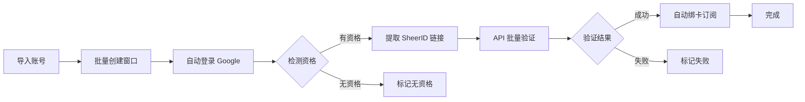
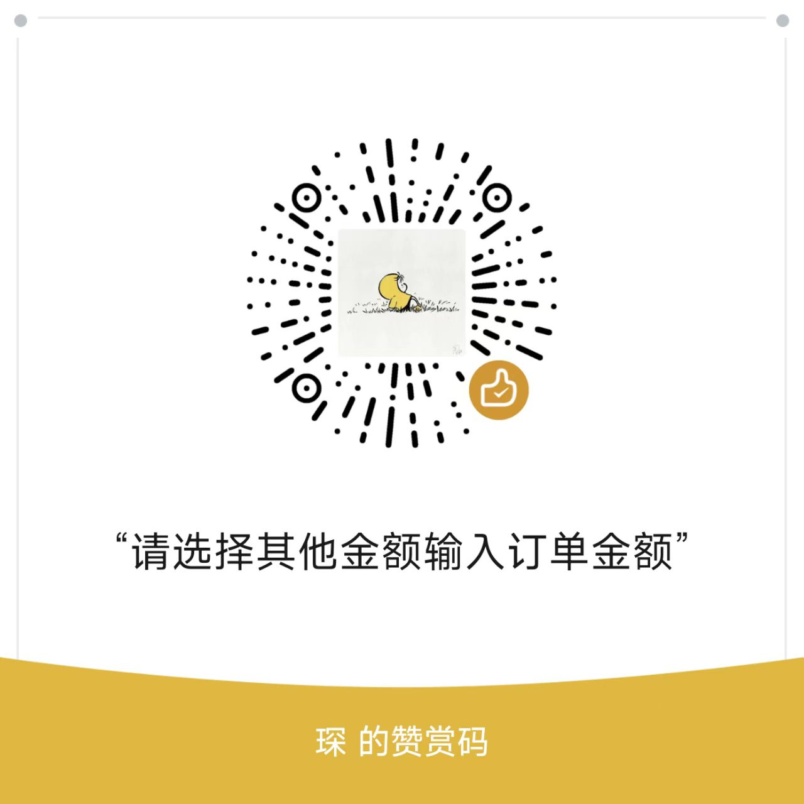

# 🚀 BitBrowser Automation System

<div align="center">


**专业的比特浏览器自动化管理系统 | Google One 学生优惠批量处理解决方案**

[快速开始](#-快速开始) • [功能特性](#-功能特性) • [技术栈](#-技术栈) • [文档](#-文档)

</div>

---

## 📢 赞助商 / Sponsors

<table>
<tr>
<td align="center" width="20%">

**🌐 比特浏览器**  
跨境电商/社媒营销指纹浏览器

👉 **[点击注册](https://www.bitbrowser.cn/?code=vl9b7j)**

</td>
<td align="center" width="20%">

**💳 HolyCard**  
Gemini/GPT订阅，一张低至2R

👉 **[立即申请](https://www.holy-card.com/)**

</td>
<td align="center" width="20%">

**💳 Vo Card**  
GPT/Gemini认证，不过包退

👉 **[chatgptcard.xyz](https://chatgptcard.xyz)**

</td>
<td align="center" width="20%">

**🤖 AI 成品号**  
Gemini/GPT/Grok 现货批发

👉 **[tehuio.com](https://tehuio.com)**

</td>
<td align="center" width="20%">

**🔥 AI 源头批发**  
ChatGPT/Gemini/Grok 续费

👉 **[m.ifaka.cloud](https://m.ifaka.cloud)**

</td>
</tr>
</table>

---

## 📋 项目简介

本项目提供两套完整的比特浏览器自动化解决方案，满足不同场景需求：

### 🌐 [Auto_All_System](Auto_All_System/) - 企业级 Web 管理系统
- **Django 5.0 + Vue 3** 构建的现代化 Web 平台
- 适合团队协作、多用户管理、大规模批量处理
- 完整的权限系统、任务队列、插件化架构
- **[查看详细文档 →](Auto_All_System/README.md)**

### 🖥️ [Auto_All_System_Pyqt](Auto_All_System_Pyqt/) - 桌面应用
- **PyQt6** 开发的轻量级桌面工具
- 适合个人使用、快速上手、本地运行
- 一键启动、无需配置服务器
- **[查看详细文档 →](Auto_All_System_Pyqt/README.md)**

---

## ✨ 功能特性

### 🎯 核心功能

| 功能 | Web 系统 | 桌面应用 | 说明 |
|------|----------|----------|------|
| **批量窗口管理** | ✅ | ✅ | 批量创建、配置、操作比特浏览器窗口 |
| **账号管理** | ✅ | ✅ | 批量导入、分类、状态追踪 |
| **SheerID 验证** | ✅ | ✅ | 自动提取链接、API批量验证 |
| **自动绑卡订阅** | ✅ | ✅ | 全自动填写信用卡并完成订阅 |
| **一键全自动** | ✅ | ✅ | 登录→检测→验证→绑卡 全流程 |
| **多用户权限** | ✅ | ❌ | RBAC 权限控制 |
| **任务队列** | ✅ | ❌ | Celery 分布式任务调度 |
| **插件系统** | ✅ | ❌ | 动态加载、热插拔 |
| **实时监控** | ✅ | ✅ | 任务进度、日志输出 |

### 🚀 自动化流程



---

## 🛠️ 技术栈

### Web 系统 (Auto_All_System)

<table>
<tr>
<td width="50%">

**后端**
- 🐍 **Django 5.0** - Web 框架
- 🗄️ **PostgreSQL** - 数据库
- ⚡ **Redis** - 缓存/队列
- 🔄 **Celery** - 异步任务
- 🎭 **Playwright** - 浏览器自动化
- 🔐 **JWT** - 身份认证

</td>
<td width="50%">

**前端**
- 💚 **Vue 3** - 渐进式框架
- 📘 **TypeScript** - 类型安全
- 🎨 **Element Plus** - UI 组件库
- 🍍 **Pinia** - 状态管理
- 📦 **Vite** - 构建工具
- 🔀 **Vue Router** - 路由管理

</td>
</tr>
<tr>
<td colspan="2">

**DevOps**
- 🐳 **Docker** - 容器化
- 🌐 **Nginx** - Web 服务器
- 🔧 **Docker Compose** - 服务编排

</td>
</tr>
</table>

### 桌面应用 (Auto_All_System_Pyqt)

- 🖼️ **PyQt6** - 跨平台 GUI 框架
- 🎭 **Playwright** - 浏览器自动化
- 💾 **SQLite** - 轻量级数据库
- 🔐 **Cryptography** - 数据加密

---

## 🚀 快速开始

### 选择适合你的版本

#### 👥 团队使用 / 需要 Web 界面
```bash
# 进入 Web 系统目录
cd Auto_All_System

# Windows 一键启动
双击运行: 一键启动.bat

# Linux/Mac
docker-compose up -d
```

**访问**: http://localhost/  
**详细文档**: [Auto_All_System/README.md](Auto_All_System/README.md)

---

#### 🖥️ 个人使用 / 快速上手
```bash
# 进入桌面应用目录
cd Auto_All_System_Pyqt

# Windows 一键启动
双击运行: scripts/启动项目.bat

# 或手动启动
pip install -r data/requirements.txt
playwright install chromium
cd src && python create_window_gui.py
```

**详细文档**: [Auto_All_System_Pyqt/README.md](Auto_All_System_Pyqt/README.md)

---

## 📖 文档

### 📚 Web 系统文档
- [📖 系统说明](Auto_All_System/README.md)
- [🚀 快速开始](Auto_All_System/文档/00-快速开始.md)
- [🗄️ 数据库设计](Auto_All_System/文档/01-数据库设计文档.md)
- [🏗️ 系统架构](Auto_All_System/文档/02-系统架构与配置.md)
- [🎨 前端功能](Auto_All_System/文档/03-前端页面功能说明.md)
- [🔌 API 接口](Auto_All_System/文档/04-API接口文档.md)
- [🧩 插件架构](Auto_All_System/文档/07-插件化架构设计.md)
- [🌐 比特浏览器 API](Auto_All_System/文档/17-比特浏览器API完整开发指南.md)

### 🖥️ 桌面应用文档
- [📖 项目说明](Auto_All_System_Pyqt/README.md)
- [🚀 快速开始](Auto_All_System_Pyqt/docs/快速开始.md)
- [⚙️ 功能说明](Auto_All_System_Pyqt/docs/功能说明.md)
- [❓ 常见问题](Auto_All_System_Pyqt/docs/常见问题.md)
- [📁 数据文件说明](Auto_All_System_Pyqt/data/README.md)

---

## 📁 项目结构

```
auto_bitbrowser/
├── Auto_All_System/              # Django + Vue Web 系统
│   ├── backend/                  # Django 后端
│   │   ├── apps/                 # 应用模块
│   │   ├── config/               # 配置
│   │   └── plugins/              # 插件
│   ├── frontend/                 # Vue 前端
│   │   ├── src/                  # 源代码
│   │   └── dist/                 # 构建输出
│   ├── 文档/                     # 完整文档
│   └── docker-compose.yml        # Docker 配置
│
├── Auto_All_System_Pyqt/         # PyQt 桌面应用
│   ├── src/                      # 源代码
│   ├── data/                     # 数据文件
│   ├── docs/                     # 文档
│   ├── scripts/                  # 启动脚本
│   └── resources/                # 资源文件
│
├── .gitignore                    # Git 忽略配置
├── .gitattributes                # Git 属性配置
└── README.md                     # 本文件
```

---

## ⚙️ 系统要求

### Web 系统
- **Python**: 3.12+
- **Node.js**: 18+
- **PostgreSQL**: 14+
- **Redis**: 7+
- **Docker**: 20+ *(推荐)*

### 桌面应用
- **Python**: 3.8+
- **比特浏览器**: 需启用 API 接口
- **操作系统**: Windows 10+

---

## 🔒 安全提示

### ⚠️ 敏感数据保护

本项目已配置 `.gitignore` 排除以下敏感文件：

- ❌ `accounts.txt` - 账号密码
- ❌ `proxies.txt` - 代理信息
- ❌ `cards.txt` - 信用卡信息
- ❌ `*.db` - 数据库文件
- ❌ `.env` - 环境变量

### ✅ 使用建议

- 🔐 使用强密码，定期更换
- 💾 定期备份重要数据
- 🚫 不要分享数据库文件
- ⚖️ 仅用于管理自己的合法账号

---

## 🤝 联系与交流

### 💬 社区交流

<table>
<tr>
<td align="center" width="50%">

**Telegram 群组**

[](https://t.me/+9zd3YE16NCU3N2Fl)

[点击加入](https://t.me/+9zd3YE16NCU3N2Fl)

</td>
<td align="center" width="50%">

**QQ 交流群**


**QQ群号: 330544197**

</td>
</tr>
</table>

### 👤 开发者

- **QQ**: 2738552008
- **使用教程**: [https://docs.qq.com/doc/DSEVnZHprV0xMR05j](https://docs.qq.com/doc/DSEVnZHprV0xMR05j?no_promotion=1&is_blank_or_template=blank)

### ☕ 赞赏支持

<div align="center">



*如果这个项目对你有帮助，欢迎请作者喝杯咖啡 ☕*

</div>

---

## ⚠️ 免责声明

- 本工具仅供学习与技术交流使用，请勿用于非法用途
- 请遵守比特浏览器及相关平台的使用条款
- 开发者不对因使用本工具产生的任何账号损失或法律责任负责
- 使用本工具即表示您同意自行承担所有风险

---

## 📄 许可证

MIT License - 详见 [LICENSE](LICENSE)

---

## 🎉 开始使用

### 我该选择哪个版本？

#### 选择 Web 系统，如果你：
- ✅ 需要团队协作和多用户管理
- ✅ 需要通过浏览器访问
- ✅ 需要大规模批量处理（100+账号）
- ✅ 需要详细的任务调度和监控
- ✅ 需要插件扩展功能

#### 选择桌面应用，如果你：
- ✅ 个人使用
- ✅ 快速上手，不想配置服务器
- ✅ 中小规模处理（<100账号）
- ✅ 只需要基本功能

#### 两个都部署，如果你：
- ✅ 想要最完整的功能
- ✅ Web 系统管理，桌面应用执行
- ✅ 数据可互通共享

---

<div align="center">

**🚀 选择你需要的系统，开始自动化之旅！**

查看对应文档了解详细使用方法

[Web 系统文档](Auto_All_System/README.md) | [桌面应用文档](Auto_All_System_Pyqt/README.md)

---

**Version**: 2.0.0 | **Last Updated**: 2026-01-19

Made with ❤️ by Auto All System Team

</div>
